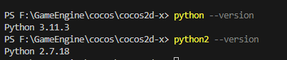

### 编译记录

#### 子模块
- 把仓库拉下来发现子模块更新不了
- 处理方法：
.gitmodules 里 `git:` 改成 `https:` <br>
- 缺少poly2tri库，添加子模块 :
``` bash
git submodule add https://github.com/greenm01/poly2tri
```
- .gitmodules 会增加这一段
```
[submodule "poly2tri"]
	path = poly2tri
	url = https://github.com/greenm01/poly2tri.git
```

#### python 安装
- 官方建议使用python2.7  (在download-deps.py : python 2.x is required. (Version 2.7 is well tested))
- window 同时安装python3 和 python2 的方法：
1. 先安装python3 并 勾选添加PATH (默认使用python3)
2. 再安装python2，在安装路径把 `python.exe`改成`python2.exe`；把`pythonw.exe`改成`pythonw2.exe`，并把python2安装路径配置到环境变量
- 检测是否安装成功：
1. python3
```bash
python --version
```
2. python2
```bash
python2 --version
```

