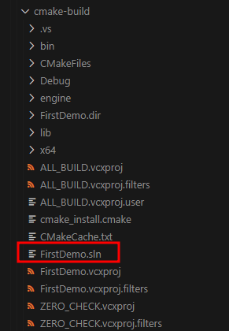

### 编译记录

#### 子模块
- 把仓库拉下来发现子模块更新不了
- 处理方法：
.gitmodules 里 `git:` 改成 `https:` <br>
- 缺少poly2tri库，添加子模块 :
``` bash
git submodule add https://github.com/greenm01/poly2tri
```
- .gitmodules 会增加这一段
```
[submodule "poly2tri"]
	path = poly2tri
	url = https://github.com/greenm01/poly2tri.git
```

#### python 安装
- 官方建议使用python2.7  (在download-deps.py : python 2.x is required. (Version 2.7 is well tested))
- window 同时安装python3 和 python2 的方法：
1. 先安装python3 并 勾选添加PATH (默认使用python3)
2. 再安装python2，在安装路径把 `python.exe`改成`python2.exe`；把`pythonw.exe`改成`pythonw2.exe`，并把python2安装路径配置到环境变量
- 检测是否安装成功：
1. python3
```bash
python --version
```
2. python2
```bash
python2 --version
```


#### 安装依赖
``` bash
$ cd cocos2d-x
  cocos2d-x $ python download-deps.py
```

#### 新建项目
- 在cocos2d-x 目录执行 setup.py 脚本，设置一系列环境变量
``` bash
$ cd cocos2d-x
$ python2 .\setup.py
```
第一次执行会提示设置`android ndk` `android sdk` 的路径。（可以跳过）
<br>

- 这里留意一个坑，由于安装python时，将python3 作为了默认版本，而cocos使用的是python2.7
执行cocos里的python脚本需要使用 python2 xxx <br>
所以cocos.bat脚本需要把python改到python2  <br>
```bash
@echo off
@python2 "%~dp0/cocos.py" %*
```

- 执行新建命令
``` bash
cocos new MyGame -p com.my_company.mygame -l cpp -d NEW_PROJECTS_DIR
```
<br>

- 修改一下路径
嗯，原本以为`NEW_PROJECTS_DIR`是个常量什么的，没想到就是以这个字符串命名，在cocosd-x目录下新建工程目录。<br>
基于强迫症，吧`NEW_PROJECTS_DIR`删了，重来
``` bash
rmdir .\NEW_PROJECTS_DIR\
cocos new FirstDemo -p com.my_company.firstDemo -l cpp -d myProjects
```

- 然后就看到了新建的工程
 <br>

- 构建并运行
``` bash
cd .\myProjects\FirstDemo\
cocos run -p win32
```
发现需要安装vs [2013, 2015, 2017] 其中一个版本<br>
<br>

尝试使用cmake（需要机器安装了cmake 3.6 或以上版本）: <br>
1. 新建 build目录
``` bash
mkdir cmake-build
```
2. 转到build目录下执行`cmake`命令
``` bash
cd cmake-build
cmake ..
```
默认用了MSVC进行编译，生成了一个vs 项目<br>
<br>
emmmm ..... <br>
还是用gcc编译吧 (需要安装 minGW)<br>
```bash
rmdir .\*
cmake .. -G "MinGW Makefiles"
make
```
然后，<br>
<br>
狗听了都摇头.png <br>

