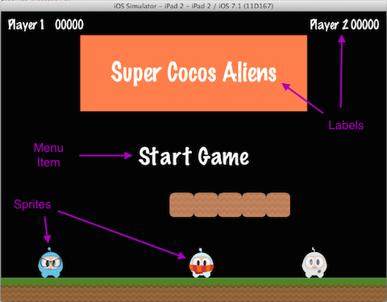

### Main Components  主要组件
[原文 Main Components](https://docs.cocos2d-x.org/cocos2d-x/v4/en/basic_concepts/getting_started.html) 
<br>
<br>

这开始可能有些令人生畏，但入门Cocos2d-x很简单。在我们深入研究之前，我们必须了解Cocos2d-x使用的一些概念。在Cocos2d-x的核心是场景（Scene）、节点（Node）、精灵（Sprite）、菜单（Menu）和动作（Action）对象。看看你喜欢的任何游戏，你会在某种形式上看到所有这些组件！<br>

让我们来看一下。这可能看起来有些类似你可能玩过的非常流行的游戏之一：<br>

 <br>

让我们再看一看，但是分割截图并识别用于构建它的组件：<br>

 <br>

你可以看到一个菜单，一些精灵和标签，它们在Cocos2d-x中都有对应物。看一看你自己的游戏设计文档，看看你有哪些组件，你可能会找到一些匹配的。<br>

**让我们构建一个游戏 - 第2步**
从前一步开始，你现在已经创建了一个名为FirstGame的Cocos2d-x项目。这很好，它允许你验证你的开发环境是否正常工作。然而，它也让你看到游戏启动时的一些代码以及在游戏启动时如何做出一些基本决策。让我们看一看其中一些类以获得一些了解。跨平台的代码存储在Classes/目录中，而平台相关的代码存储在每个平台的文件夹中，例如proj.android、proj.ios_mac、proj.linux、proj.win32。

**AppDelegate（应用代理）**
AppDelegate是一个非常重要的类。一旦运行完所有平台相关的代码，就会调用AppDelegate。魔法就从这里开始！来看看它。让我们讨论一下其中一些关键部分！

- **设计分辨率** - 帮助确定如何设计你的精灵对象的大小（等等）。这基于游戏运行设备的屏幕大小。因此，最好在不同屏幕分辨率的几台设备上测试你的游戏。以下是AppDelegate中相关的部分：

```cpp
static cocos2d::Size designResolutionSize = cocos2d::Size(480, 320);
static cocos2d::Size smallResolutionSize = cocos2d::Size(480, 320);
static cocos2d::Size mediumResolutionSize = cocos2d::Size(1024, 768);
static cocos2d::Size largeResolutionSize = cocos2d::Size(2048, 1536);
```

- **AppDelegate::applicationDidFinishLaunching()** - 这是你将开始编写游戏代码的主要地方。这个函数已经为你做了很多事情，但根据你的需求可能需要进行调整。请考虑以下几行代码，其中加载并运行第一个场景，使用HelloWorld类：

```cpp
// create a scene. it's an autorelease object
auto scene = HelloWorld::createScene();

// run
director->runWithScene(scene);
```

**进行一些代码更改**
为了让我们开始使这个游戏更加个性化，我们可以更改glView的标题。这是在AppDelegate类中进行的简单更改。看看（或使用查找）以下几行：

```cpp
if(!glview) {
#if (CC_TARGET_PLATFORM == CC_PLATFORM_WIN32) || (CC_TARGET_PLATFORM == CC_PLATFORM_MAC) || (CC_TARGET_PLATFORM == CC_PLATFORM_LINUX)
        glview = GLViewImpl::createWithRect("FirstGame", cocos2d::Rect(0, 0, designResolutionSize.width, designResolutionSize.height));
#else
        glview = GLViewImpl::create("FirstGame");
#endif
        director->setOpenGLView(glview);
}
```

注意代码中的：`"FirstGame"`。我们可以将其更改为`"Bubble Shooter"`。确保在两个地方都进行更改！这不会更改任何IDE项目名称或目录名称。<br>

完成了这一步后，继续阅读... <br>