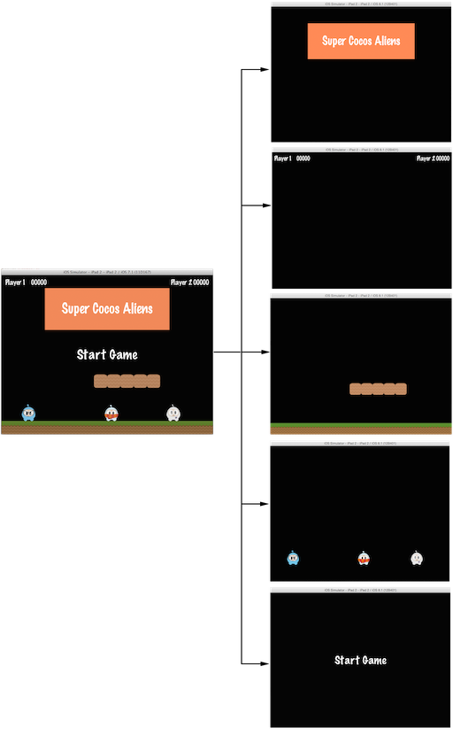

### Scenes and the Scene Graph  场景和场景图
[原文 Scenes and the Scene Graph](https://docs.cocos2d-x.org/cocos2d-x/v4/en/basic_concepts/scene.html) 
<br>
<br>

在你的游戏中，你可能想要一个主菜单、几个关卡和一个结束场景。你如何将它们组织成它们各自的独立部分？你猜对了，场景（Scene）。当你想象你最喜欢的电影时，你会发现它明显地被分成场景，或者说是故事情节的不同部分。如果我们将这种思考过程应用于游戏，无论游戏有多简单，我们都应该得出至少几个场景。<br>

再次看一看之前熟悉的图像：<br>

<br>

这是一个主菜单，它是一个单独的场景。这个场景由几个部分组成，它们都相互配合形成最终结果。场景由渲染器绘制。渲染器负责收集应该出现在屏幕上的所有内容，以及它应该是什么样子，然后将其呈现在屏幕上。为了更好地理解这一点，我们需要谈一谈场景图。<br>

**场景图**
场景图是一种安排图形场景的数据结构。场景图包含节点对象，以树（是的，它被称为场景图，但实际上它是由树表示的）的结构排列。<br>

听起来和看起来很复杂。我相信你正在问为什么要关心这个技术细节，如果Cocos2d-x为你做了这么多的工作？了解场景对象如何由渲染器绘制确实很重要。<br>

一旦你开始向游戏中添加节点（Node）、精灵（Sprite）和动画（Animation）对象，你希望确保你绘制了你期望的东西。但是，如果没有呢？如果你的精灵对象隐藏在背景中，而你希望它们成为最前面的对象呢？没关系，只需退一步，通过纸上的场景图运行一下，我敢打赌你会很容易找到错误。<br>

由于场景图是一棵树，你可以遍历这棵树。Cocos2d-x使用中序遍历算法。中序遍历是从树的左侧遍历，然后是根节点，然后是树的右侧。由于树的右侧最后被渲染，它首先显示在场景图上。<br>

场景图很容易演示，让我们来看一下我们游戏场景的分解：<br>

<br>

这个示例游戏场景将被简化为以下的树：<br>

<br>

另一个要考虑的要点是，具有负z-order的元素位于树的左侧，而具有正z-order的元素位于树的右侧。在排序元素时请记住这一点！当然，你可以以任何顺序添加元素，并且它们会根据可自定义的z-order自动排序。<br>

基于这个概念，我们可以将场景看作是节点对象的集合。让我们分解上面的场景，看看场景图如何使用z-order来布局场景：<br>

 <br>

左侧的场景实际上由多个节点对象组成，它们被赋予不同的z-order以使它们堆叠在彼此之上。<br>

在Cocos2d-x中，你使用`addChild()` API调用构建场景图：<br>

```cpp
// 添加一个z-order为-2的子节点，这意味着它放在树的“左”侧（因为它是负数）
scene->addChild(title_node, -2);

// 当不指定z-order时，它将使用0
scene->addChild(label_node);

// 添加一个z-order为1的子节点，这意味着它放在树的“右”侧（因为它是正数）
scene->addChild(sprite_node, 1);
```

**让我们构建一个游戏 - 第4步**
在继续构建我们的游戏时，我们需要思考一下我们的游戏以及我们将需要哪些场景对象。有些游戏只使用一个单独的场景对象。这通过从场景中删除所有节点对象并用构成下一个场景的新节点对象替换它们来实现。这是一种有效的方法。另一种方法可能是将游戏分解为主菜单和游戏场景。第三种方法可能是将游戏进一步分解为主菜单、第1关->第N关，最后是一个结束场景。你甚至可以在不同场景对象之间添加小的过渡，通常称为切换场景。也许这些过渡场景在加载下一关时继续讲故事或只是在后台加载时视觉上刺激用户。<br>

在这个游戏中，让我们采用将游戏分解为一个引导场景、游戏场景和一个结束场景的方法。为此，我们需要创建3个几乎完全相同的类，至少在开始时是这样。随着我们在游戏的每个部分上工作，这些类将会改变。程序员之间存在对于是否要有太多或太少类的争论。我们暂时将这场辩论留到以后。现在，目标是尽可能清晰，让那些刚接触C++和游戏开发的人不至于一边学习两者而感到困扰。<br>

现在让我们添加上面提到的类。类只是源文件。你可以从命令行或你喜欢的文本编辑器中创建它们。如果你使用的是IDE，如果你对类的创建还不熟悉，可能甚至有一个向导可以运行。 <br>