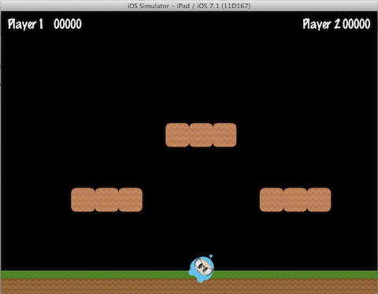
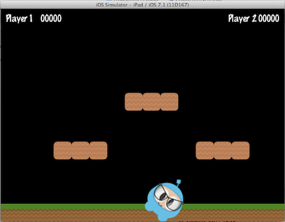
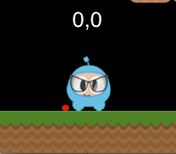
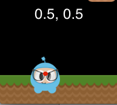

### Sprites 精灵
[原文 Sprites](https://docs.cocos2d-x.org/cocos2d-x/v4/en/basic_concepts/sprites.html) 
<br>
<br>

所有游戏都有精灵对象，你可能知道它们是什么，也可能不知道。精灵是你在屏幕上移动的对象。你可以对它们进行操作。你游戏中的主角可能就是一个精灵。我知道你可能会想 - 难道不是每个图形对象都是精灵吗？不是的！为什么？嗯，只有在你移动它时，它才是一个精灵。如果你不移动它，它只是一个节点。<br>

再次看一看上面的图像，让我们指出哪些是精灵，哪些是节点：<br>

 <br>

精灵在所有游戏中都很重要。编写一个平台游戏，你可能有一个由某种图像制成的主角。这就是一个精灵。 <br>

精灵易于创建，并且它们具有可配置的属性，如：位置、旋转、缩放、不透明度、颜色等。<br>

```cpp
// 这是如何创建一个精灵
auto mySprite = Sprite::create("mysprite.png");

// 这是如何更改精灵的属性
mySprite->setPosition(Vec2(500, 0));

mySprite->setRotation(40);

mySprite->setScale(2.0); // 同时设置X轴和Y轴的比例

mySprite->setAnchorPoint(Vec2(0, 0));
```

让我们说明每个属性，考虑一下本章示例代码的以下截图：


如果我们使用 `mySprite->setPosition(Vec2(500, 0));` 设置位置：<br>
 <br>

请注意，精灵的位置已经从原始位置更改为我们指定的新位置。<br>

如果现在设置新的旋转，使用 `mySprite->setRotation(40);`：<br>
 <br>

...你会看到精灵已经旋转到指定的新角度。<br>

如果现在使用 `mySprite->setScale(2.0);` 指定一个新的缩放：<br>


同样，我们可以看到精灵根据我们的代码更改而改变。<br>

最后，所有节点对象（因为精灵是节点的子类）都有一个锚点（anchor point）的值。我们还没有讨论过这一点，所以现在是个好时机。你可以将锚点看作是在设置其位置时，指定精灵的哪一部分将作为基础坐标的一种方法。<br>

使用我们示例游戏中的角色，并将锚点设置为 `0, 0`：<br>

```cpp
mySprite->setAnchorPoint(Vec2(0, 0));
```

会导致我们精灵的左下角被用作任何 `setPosition()` 调用的基础。让我们看看这些在实际中的应用：<br>





看一下每张图片中的红点。这个红点说明了锚点的位置！<br>

正如你所看到的，锚点在定位节点时非常有用。你甚至可以动态调整锚点以模拟游戏中的效果。<br>

我们实际上可以调整精灵的几乎每个方面。但是，如果我们希望以自动化、时间确定的方式进行这些相同类型的更改呢？好的，继续阅读... <br>