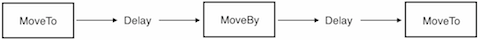

### Sequences and Spawns 序列和批量（动作）
[原文 Sequences and Spawns](https://docs.cocos2d-x.org/cocos2d-x/v4/en/basic_concepts/sequences.html) 
<br>
<br>

在屏幕上移动精灵对象后，我们就有了创建游戏所需的一切，对吧？并不完全是。多个动作怎么办？是的，Cocos2d-x也通过几种不同的方式处理这个问题。<br>

就像名字听起来的那样，Sequence 是按指定顺序运行的多个 Action 对象。需要按相反的顺序运行 Sequence 吗？没问题，Cocos2d-x 可以在不需要额外工作的情况下处理这个问题。<br>

看一下一个移动精灵的示例 Sequence 的流程：<br>



创建 Sequence 很简单：<br>

```cpp
auto mySprite = Node::create();

// 移动到点（50,10），持续2秒
auto moveTo1 = MoveTo::create(2, Vec2(50,10));

// 从当前位置向右移动100个像素，向上移动10个像素，持续2秒
auto moveBy1 = MoveBy::create(2, Vec2(100,10));

// 移动到点（150,10），持续2秒
auto moveTo2 = MoveTo::create(2, Vec2(150,10));

// 创建延迟
auto delay = DelayTime::create(1);

mySprite->runAction(Sequence::create(moveTo1, delay, moveBy1, delay.clone(),
moveTo2, nullptr));
```

这个示例按顺序运行一个 Sequence，但是如果要同时运行所有指定的动作呢？Cocos2d-x 也支持这个，称为 Spawn。Spawn 会获取所有指定的 Action 对象，并同时执行它们。有些动作可能比其他动作持续时间更长，因此如果是这种情况，它们不会同时完成。

```cpp
auto myNode = Node::create();

auto moveTo1 = MoveTo::create(2, Vec2(50,10));
auto moveBy1 = MoveBy::create(2, Vec2(100,10));
auto moveTo2 = MoveTo::create(2, Vec2(150,10));

myNode->runAction(Spawn::create(moveTo1, moveBy1, moveTo2, nullptr));
```

为什么需要 Spawn 动作呢？有什么原因吗？当然有！如果你的主角在获得强化时有多个动作，怎么办？也许在关卡结束时打败 Boss 需要多个动作来结束关卡。