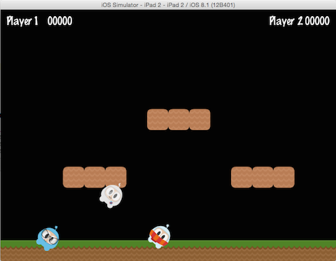

### Parent Child Relationship 父子（节点）关系
[原文 Parent Child Relationship](https://docs.cocos2d-x.org/cocos2d-x/v4/en/basic_concepts/parent_child.html) 
<br>
<br>

Cocos2d-x 使用父子关系。这意味着对父节点的属性和更改会应用到其子节点。考虑一个单独的精灵，然后是一个有子节点的精灵：<br>

<br>

有了子节点，改变父节点的旋转也会改变所有子节点的旋转：<br>
<br>

```cpp
auto myNode = Node::create();

// 通过设置旋转
myNode->setRotation(50);
```

就像旋转一样，如果更改父节点的缩放，子节点也会被缩放：<br>
<br>

```cpp
auto myNode = Node::create();

// 通过设置缩放
myNode->setScale(2.0); // 均匀缩放为2.0
```

并非所有对父节点的更改都会传递给其子节点。更改父节点的锚点只影响变换操作（缩放、位置、旋转、倾斜等...），不会影响子节点的定位。实际上，子节点将始终添加到其父节点的左下角（0,0）位置。