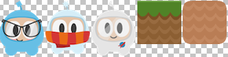

### Creating a Sprite from a Sprite Sheet  通过精灵集（图集）创建精灵
[原文 Creating a Sprite from a Sprite Sheet](https://docs.cocos2d-x.org/cocos2d-x/v4/en/sprites/spritesheets.html) 
<br>
<br>

精灵集是将精灵合并到单个文件中的一种方法。使用精灵集有助于通过批处理绘制调用来实现更好的性能。在精灵能够更有效地打包到一个图集中的情况下，它们还可以在节省磁盘和视频内存方面发挥作用（通常需要使用特殊工具）。在高级章节中，你将更多地了解这一点，这是行业中用于提高游戏性能的许多标准方法之一。<br>

使用精灵集时，首先将其完全加载到 SpriteFrameCache 中。SpriteFrameCache 是一个缓存类，保留添加到其中的 SpriteFrame 对象，以便将来更快地访问。SpriteFrame 只加载一次并在 SpriteFrameCache 中保留。<br>

这里有一个精灵集的例子：<br>



乍一看可能不起眼，但让我们仔细看看发生了什么：<br>


正如你所看到的，精灵集至少减少了不必要的空间，并将所有精灵合并到一个单一的文件中。<br>

让我们将所有这些联系在一起！<br>

**加载精灵集**
在 AppDelegate 中加载你的精灵集，可能是这样：<br>

```cpp
// 加载精灵集
auto spritecache = SpriteFrameCache::getInstance();

// .plist 文件可以使用下面提到的任何工具生成
spritecache->addSpriteFramesWithFile("sprites.plist"); 
```

现在我们已经将精灵集加载到 SpriteFrameCache 中，我们可以通过利用它来创建 Sprite 对象。<br>

**用于创建精灵集的工具**
手动创建精灵集是一个繁琐的过程。幸运的是，有一些工具可以自动生成它们。这些工具还可以提供更多的方法，以调整你的精灵集以实现最大程度的优化！<br>

以下是一些工具：<br>

- [Texture Packer（推荐）](https://www.codeandweb.com/texturepacker)
- [ShoeBox](http://renderhjs.net/shoebox/)
- [Zwoptex](https://www.zwopple.com/zwoptex/)
- [Sprite Sheet Packer](http://amakaseev.github.io/sprite-sheet-packer/)
