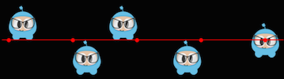
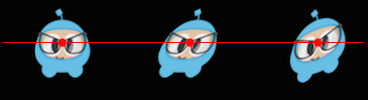

### Sprite Manipulation  操纵精灵
[原文 Sprite Manipulation](https://docs.cocos2d-x.org/cocos2d-x/v4/en/sprites/manipulation.html) 
<br>
<br>

在创建 Sprite 后，你将可以访问其各种属性，这些属性可以进行操作。<br>

给定：<br>

```cpp
auto mySprite = Sprite::create("mysprite.png");
```


**锚点和位置**
锚点是您设置的一个点，用于指定在设置其位置时将使用精灵的哪一部分。锚点仅影响可以进行变换的属性，包括比例、旋转、倾斜。这不包括颜色和不透明度。锚点使用左下坐标系。这意味着在指定 X 和 Y 坐标值时，您需要确保从左下角开始计算。默认情况下，所有 Node 对象的默认锚点为 (0.5, 0.5)。<br>

设置锚点很容易：<br>

```cpp
// 所有精灵的默认锚点
mySprite->setAnchorPoint(0.5, 0.5);

// 左下角
mySprite->setAnchorPoint(0, 0);

// 左上角
mySprite->setAnchorPoint(0, 1);

// 右下角
mySprite->setAnchorPoint(1, 0);

// 右上角
mySprite->setAnchorPoint(1, 1);
```
直观展示:<br>
<br>

**锚点影响的 Sprite 属性**
使用锚点只影响可以进行变换的属性，包括缩放、旋转、倾斜。

**位置**
精灵的位置受其锚点的影响，因为正是这一点被用作定位的起点。让我们直观地看看这是如何发生的。注意彩色线和精灵位置之间的关系。请注意，当我们更改锚点值时，仅仅改变了锚点值。我们没有使用 setPosition() 语句来实现这一点：
<br>
除了设置锚点，还有其它方式设置位置。精灵对象的位置还可以通过`setPosition()`方法设置：
```cpp
// position a sprite to a specific position of x = 100, y = 200.
mySprite->setPosition(Vec2(100, 200));
```

**旋转**
通过正负度数更改精灵的旋转。正值顺时针旋转精灵对象，而负值逆时针旋转精灵对象。默认值为 0。

```cpp
// 以 +20 度旋转精灵
mySprite->setRotation(20.0f);

// 以 -20 度旋转精灵
mySprite->setRotation(-20.0f);

// 以 +60 度旋转精灵
mySprite->setRotation(60.0f);

// 以 -60 度旋转精灵
mySprite->setRotation(-60.0f);
```
<br>

**缩放**
通过 x、y 或均匀缩放 x 和 y 更改精灵的缩放。默认值为 x 和 y 均为 1.0。

```cpp
// 均匀增加 X 和 Y 大小 2.0
mySprite->setScale(2.0);

// 仅增加 X 缩放 2.0
mySprite->setScaleX(2.0);

// 仅增加 Y 缩放 2.0
mySprite->setScaleY(2.0);
```
<br>

**倾斜**
通过 x、y 或均匀 x 和 y 更改精灵的倾斜。默认值为 x 和 y 均为 0.0。

```cpp
// 通过 20.0 调整 X 倾斜
mySprite->setSkewX(20.0f);

// 通过 20.0 调整 Y 倾斜
mySprite->setSkewY(20.0f);
```
<br>

**不受锚点影响的 Sprite 属性**
有一些 Sprite 对象的属性不受锚点的影响。为什么呢？因为它们只改变表面特性，如颜色和不透明度。

**颜色**
更改精灵的颜色。这是通过传递 Color3B 对象完成的。Color3B 对象是 RGB 值。我们还没有遇到 Color3B，但它只是定义 RGB 颜色的对象。RGB 颜色是从 0 到 255 的 3 字节值。Cocos2d-x 还提供了您可以选择的预定义颜色。使用这些将会更快一些，因为它们是预定义的。一些示例：Color3B::White 和 Color3B::Red。

```cpp
// 通过传递预定义的 Color3B 对象设置颜色。
mySprite->setColor(Color3B::WHITE);

// 通过传递 Color3B 对象设置颜色。
mySprite->setColor(Color3B(255, 255, 255)); // 与 Color3B::WHITE 相同
```
<br>

**不透明度**
通过指定的值更改精灵的不透明度。不透明对象根本不透明。此属性期望值从 0 到 255，其中 255 表示完全不透明，0 表示完全透明。想一下：零不透明度意味着不可见，您将始终了解其工作原理。默认值为 255（完全不透明）。

```cpp
// 将不透明度设置为 30，这使得此精灵为 11.7% 不透明。
// （30 除以 256 等于 0.1171875...）
mySprite->setOpacity(30);
```
<br>