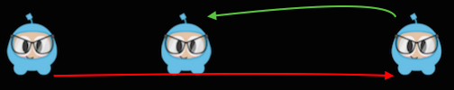

### By and To, what is the difference?  By和To的区别是什么？
[原文 By and To, what is the difference?](https://docs.cocos2d-x.org/cocos2d-x/v4/en/actions/getting_started.html) 
<br>
<br>

你会注意到每个动作都有 By 和 To 版本。为什么呢？因为它们在实现上有所不同。By 是相对于 Node 的当前状态的。To 动作是绝对的，意味着它不考虑 Node 的当前状态。让我们看一个具体的例子：

```cpp
auto mySprite = Sprite::create("mysprite.png");
mySprite->setPosition(Vec2(200, 256));

// MoveBy - 让精灵在 x 轴上移动 500，耗时 2 秒
// MoveBy 是相对的 - 因为 x = 200 + 500，移动后 x 现在是 700
auto moveBy = MoveBy::create(2, Vec2(500, mySprite->getPositionY()));

// MoveTo - 让精灵移动到新位置 (300, 256)，耗时 2 秒
// MoveTo 是绝对的 - 不管它现在在哪里，精灵都会被移动到 (300, 256)。
auto moveTo = MoveTo::create(2, Vec2(300, mySprite->getPositionY()));

// Delay - 创建一个小的延迟
auto delay = DelayTime::create(1);

auto seq = Sequence::create(moveBy, delay, moveTo, nullptr);

mySprite->runAction(seq);
```

这个例子中，MoveBy 是相对于当前位置进行移动，而 MoveTo 是绝对移动到指定位置。在序列中，先执行 MoveBy，然后延迟 1 秒，最后执行 MoveTo。


