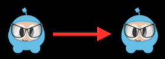
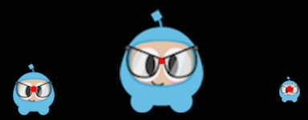
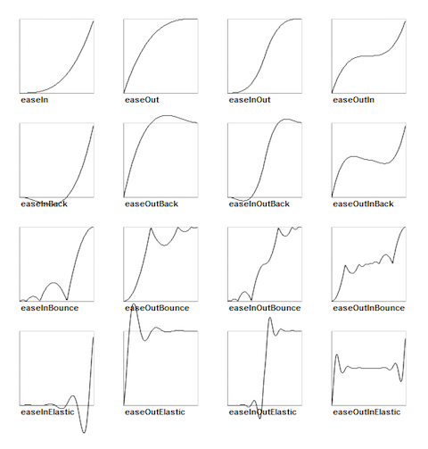

### Basic Actions and how to run them  基础动画以及如何运行
[原文 Basic Actions and how to run them](https://docs.cocos2d-x.org/cocos2d-x/v4/en/actions/basic.html) 
<br>
<br>

基础动作通常是单一的动作，因此完成一个单一的目标。让我们看一些例子：<br>

**Move**
在一段时间内移动一个 Node。

```cpp
auto mySprite = Sprite::create("mysprite.png");

// 将精灵移动到指定位置，耗时 2 秒
auto moveTo = MoveTo::create(2, Vec2(50, 0));

mySprite->runAction(moveTo);

// 将精灵向右移动 50 个像素，并向上移动 0 个像素，耗时 2 秒
auto moveBy = MoveBy::create(2, Vec2(50, 0));

mySprite->runAction(moveBy);
```


**Rotate**
顺时针旋转 Node，耗时 2 秒。

```cpp
auto mySprite = Sprite::create("mysprite.png");

// 在 2 秒内将 Node 旋转到指定角度
auto rotateTo = RotateTo::create(2.0f, 40.0f);
mySprite->runAction(rotateTo);

// 顺时针将 Node 旋转 40 度，耗时 2 秒
auto rotateBy = RotateBy::create(2.0f, 40.0f);
mySprite->runAction(rotateBy);
```


**Scale**
在 2 秒内将 Node 缩放为 10。

```cpp
auto mySprite = Sprite::create("mysprite.png");

// 均匀地按 3 倍缩放，在 2 秒内
auto scaleBy = ScaleBy::create(2.0f, 3.0f);
mySprite->runAction(scaleBy);

// 将 X 缩放 5 倍，将 Y 缩放 3 倍，在 2 秒内
auto scaleBy = ScaleBy::create(2.0f, 5.0f, 3.0f);
mySprite->runAction(scaleBy);

// 将均匀缩放为 3 倍，在 2 秒内
auto scaleTo = ScaleTo::create(2.0f, 3.0f);
mySprite->runAction(scaleTo);

// 将 X 缩放为 5，将 Y 缩放为 3 倍，在 2 秒内
auto scaleTo = ScaleTo::create(2.0f, 5.0f, 3.0f);
mySprite->runAction(scaleTo);
```


**Fade In/Out**
淡入/淡出 Node。

它将透明度从 0 改变到 255。它的反向操作是 FadeOut。

```cpp
auto mySprite = Sprite::create("mysprite.png");

// 在 1 秒内淡入精灵
auto fadeIn = FadeIn::create(1.0f);
mySprite->runAction(fadeIn);

// 在 2 秒内淡出精灵
auto fadeOut = FadeOut::create(2.0f);
mySprite->runAction(fadeOut);
```


**Tint**
将实现 NodeRGB 协议的 Node 从当前颜色着色到自定义颜色。

```cpp
auto mySprite = Sprite::create("mysprite.png");

// 将节点着色为指定的 RGB 值
auto tintTo = TintTo::create(2.0f, 120.0f, 232.0f, 254.0f);
mySprite->runAction(tintTo);

// 将节点按指定 RGB 值的增量进行着色。
auto tintBy = TintBy::create(2.0f, 120.0f, 232.0f, 254.0f);
mySprite->runAction(tintBy);
```


**Animate**
使用 Animate，可以对 Sprite 对象进行简单的翻页动画。这仅仅是在动画的持续时间内以一定的间隔替换显示帧。让我们考虑这个例子：

```cpp
auto mySprite = Sprite::create("mysprite.png");

// 现在让我们对移动的精灵进行动画
Vector<SpriteFrame*> animFrames;
animFrames.reserve(12);
animFrames.pushBack(SpriteFrame::create("Blue_Front1.png", Rect(0,0,65,81)));
animFrames.pushBack(SpriteFrame::create("Blue_Front2.png", Rect(0,0,65,81)));
animFrames.pushBack(SpriteFrame::create("Blue_Front3.png", Rect(0,0,65,81)));
animFrames.pushBack(SpriteFrame::create("Blue_Left1.png", Rect(0,0,65,81)));
animFrames.pushBack(SpriteFrame::create("Blue_Left2.png", Rect(0,0,65,81)));
animFrames.pushBack(SpriteFrame::create("Blue_Left3.png", Rect(0,0,65,81)));
animFrames.pushBack(SpriteFrame::create("Blue_Back1.png", Rect(0,0,65,81)));
animFrames.pushBack(SpriteFrame::create("Blue_Back2.png", Rect(0,0,65,81)));
animFrames.pushBack(SpriteFrame::create("Blue_Back3.png", Rect(0,0,65,81)));
animFrames.pushBack(SpriteFrame::create("Blue_Right1.png", Rect(0,0,65,81)));
animFrames.pushBack(SpriteFrame::create("Blue_Right2.png", Rect(0,0,65,81)));
animFrames.pushBack(SpriteFrame::create("Blue_Right3.png", Rect(0,0,65,81)));

// 使用这些帧创建动画
Animation* animation = Animation::createWithSpriteFrames(animFrames, 0.1f);
Animate* animate = Animate::create(animation);

// 运行它并永久重复
mySprite->runAction(RepeatForever::create(animate));
```

很难通过文本展示动画，所以请运行示例程序员指南中的示例代码，以查看它的效果！

**Easing**
使用指定的加速度进行缓动，使动画更加平滑。需要记住的一点是，无论速度如何，缓动动作始终在相同的时间开始和结束。缓动动作是在游戏中伪造物理效果的好方法！也许您想要一些模拟的物理效果，但不想为一些非常基本的动作增加所有这些复杂性和开销。另一个很好的例子是对菜单和按钮进行动画处理。<br>

这里显示了常见的缓动函数在图表上：<br>

 <br>
支持上图中大多数缓动函数。它们也很容易实现。让我们看一个具体的用例。让我们从屏幕顶部掉下一个 Sprite 对象，并让它反弹。<br>

```cpp
// 创建一个精灵
auto mySprite = Sprite::create("mysprite.png");

// 创建一个 MoveBy 动作，将精灵从我们想要的位置掉下来。
auto move = MoveBy::create(2, Vec2(200, dirs->getVisibleSize().height - newSprite2->getContentSize().height));

// 创建一个 BounceIn 缓动动作
auto move_ease_in = EaseBounceIn::create(move->clone());
auto move_ease_in_back = move_ease_in->reverse();

// 创建一个在序列事件之间运行的延迟
auto delay = DelayTime::create(0.25f);

// 按照我们想要运行它们的顺序，创建一系列动作
auto seq1 = Sequence::create(move_ease_in, delay, move_ease_in_back, delay->clone(), nullptr);

// 运行序列并永久重复。
mySprite->runAction(RepeatForever::create(seq1));
```

运行示例程序员指南中的示例代码以查看它的效果！
