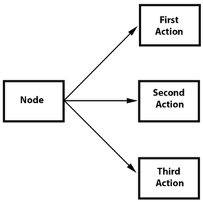
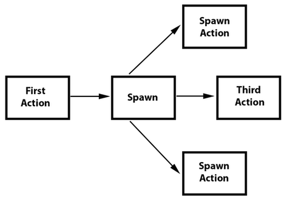

### Sequences and how to run them  序列及其运行
[原文 Sequences and how to run them](https://docs.cocos2d-x.org/cocos2d-x/v4/en/actions/sequences.html) 
<br>
<br>

动作序列是要按顺序执行的一系列动作对象。这可以是任意数量的动作对象、函数，甚至是另一个序列。函数？是的！Cocos2d-x 有一个 CallFunc 对象，允许你创建一个 function() 并将其传递给在你的序列中运行。这允许你在序列对象中添加除了 Cocos2d-x 提供的默认动作对象之外的功能。下面是一个执行时的序列示例：<br>


```cpp
auto mySprite = Sprite::create("mysprite.png");

// 创建一些动作。
auto jump = JumpBy::create(0.5, Vec2(0, 0), 100, 1);

auto rotate = RotateTo::create(2.0f, 10);

// 创建一些回调
auto callbackJump = CallFunc::create([](){
    log("Jumped!");
});

auto callbackRotate = CallFunc::create([](){
    log("Rotated!");
});

// 创建包含动作和回调的序列
auto seq = Sequence::create(jump, callbackJump, rotate, callbackRotate, nullptr);

// 执行它
mySprite->runAction(seq);
```

那么这个 Sequence 动作都做了什么呢？<br>

它将按顺序执行以下动作：<br>

Jump -> callbackJump() -> Rotate -> callbackRotate()<br>

在序列中添加延迟 <br>
有时，您可能希望创建一个在每个动作之间具有小延迟的序列。您可以使用 CallFunc 来实现这一点。例如：<br>

```cpp
// 使用在项目之间具有延迟的序列
cocos2d::CallFunc* A = cocos2d::CallFunc::create([=]() {
    // 做一些事情
});
cocos2d::CallFunc* B = cocos2d::CallFunc::create([=]() {
    // 做一些事情
});
cocos2d::CallFunc* C = cocos2d::CallFunc::create([=]() {
    // 做一些事情
});

cocos2d::DelayTime* delay = cocos2d::DelayTime::create(1);

runAction(cocos2d::Sequence::create(A, delay, B, delay, C, NULL));
```

**Spawn**
Spawn 与 Sequence 非常相似，唯一的区别在于所有动作将同时运行。您可以有任意数量的动作对象，甚至是其他 Spawn 对象！<br>


Spawn 产生的结果与运行多个连续的 runAction() 语句相同。然而，Spawn 的好处是你可以将它放在 Sequence 中，以帮助实现否则无法实现的特定效果。结合 Spawn 和 Sequence 是一个非常强大的功能。<br>

例如，给定：<br>

```cpp
// 创建 2 个动作并在 Sprite 上运行 Spawn
auto mySprite = Sprite::create("mysprite.png");

auto moveBy = MoveBy::create(10, Vec2(400,100));
auto fadeTo = FadeTo::create(2.0f, 120.0f);
```

使用 Spawn：<br>

```cpp
// 使用 Spawn 运行上述动作。
auto mySpawn = Spawn::createWithTwoActions(moveBy, fadeTo);
mySprite->runAction(mySpawn);
```

和连续的 runAction() 语句：<br>

```cpp
// 使用连续的 runAction() 语句运行上述动作。
mySprite->runAction(moveBy);
mySprite->runAction(fadeTo);
```

两者都会产生相同的结果。然而，可以在 Sequence 中使用 Spawn。这个流程图展示了这可能是什么样子：


```cpp
// 创建一个 Sprite
auto mySprite = Sprite::create("mysprite.png");

// 创建一些动作
auto moveBy = MoveBy::create(10, Vec2(400,100));
auto fadeTo = FadeTo::create(2.0f, 120.0f);
auto scaleBy = ScaleBy::create(2.0f, 3.0f);

// 创建要使用的 Spawn
auto mySpawn = Spawn::createWithTwoActions(scaleBy, fadeTo);

// 在序列中将所有内容绑在一起
auto seq = Sequence::create(moveBy, mySpawn, moveBy, nullptr);

// 运行它
mySprite->runAction(seq);
```