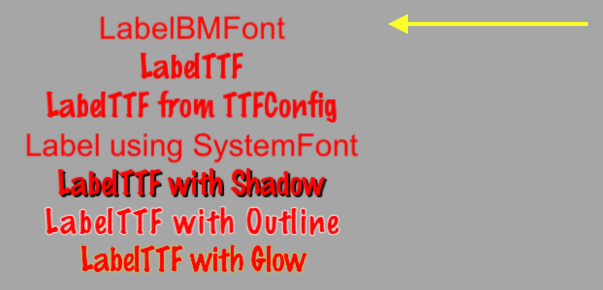
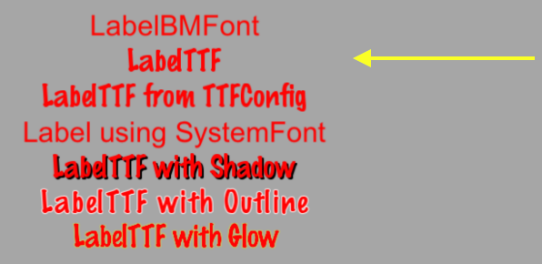
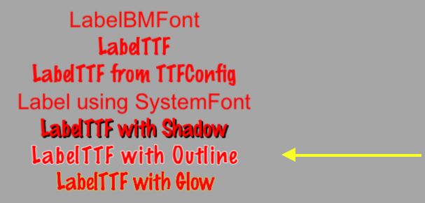
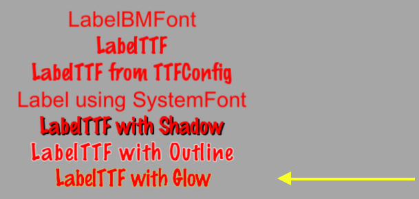

### Label  标签（文本）
[原文 Label](https://docs.cocos2d-x.org/cocos2d-x/v4/en/ui_components/labels.html) 
<br>
<br>

#### 标签
Cocos2d-x提供了一个Label对象，可以使用TrueType、位图或内置系统字体创建标签。这个单一的类可以处理所有你的标签需求。

#### Label BMFont
BMFont是一种使用位图字体的标签类型。位图字体中的字符由点阵组成。它非常快速且易于使用，但不可伸缩，因为它需要为每个大小的字符使用单独的字体。标签中的每个字符都是一个独立的Sprite。这意味着每个字符都可以旋转、缩放、着色，具有不同的锚点和/或更改任何其他属性。<br>

创建BMFont标签需要两个文件：一个.fnt文件和一个以.png格式表示的每个字符的图像。如果你使用Glyph Designer等工具，这些文件会自动为你创建。从位图字体创建标签对象：<br>

```cpp
auto myLabel = Label::createWithBMFont("bitmapRed.fnt", "Your Text");
```


字符串参数中的所有字符应该在提供的.fnt文件中找到，否则它们将不会呈现。如果呈现一个标签对象并且缺少字符，请确保它们存在于你的.fnt文件中。

#### Label TTF
TrueType字体与上面学到的位图字体不同。TrueType字体呈现字体的轮廓。这是方便的，因为你不需要为每个希望使用的大小和颜色单独设置字体文件。创建使用TrueType字体的标签对象很容易。要创建一个，你需要指定.ttf字体文件名、文本字符串和大小。与BMFont不同，TTF可以在无需单独的字体文件的情况下呈现大小更改。例如，使用TrueType字体：<br>

```cpp
auto myLabel = Label::createWithTTF("Your Text", "Marker Felt.ttf", 24);
```


尽管它比位图字体更灵活，但TrueType字体的呈现速度较慢，更改字体和大小等属性是昂贵的操作。<br>

如果你需要从TrueType字体创建具有相同属性的多个标签对象，可以创建一个TTFConfig对象来管理它们。TTFConfig对象允许你设置所有标签共有的属性。你可以将其视为所有标签对象都使用相同成分的食谱。<br>

你可以这样为标签创建一个TTFConfig对象：<br>

```cpp
// 为标签创建一个TTFConfig文件，以便共享
TTFConfig labelConfig;
labelConfig.fontFilePath = "myFont.ttf";
labelConfig.fontSize = 16;
labelConfig.glyphs = GlyphCollection::DYNAMIC;
labelConfig.outlineSize = 0;
labelConfig.customGlyphs = nullptr;
labelConfig.distanceFieldEnabled = false;

// 从TTFConfig文件创建一个TTF标签。
auto myLabel = Label::createWithTTF(labelConfig, "My Label Text");
```


TTFConfig也可以用于显示中文、日文和韩文字符。<br>

#### Label SystemFont
SystemFont是一种使用默认系统字体和字体大小的标签类型。这是一种不应更改其属性的字体。你应该将其视为系统字体，系统规则。创建SystemFont标签：<br>

```cpp
auto myLabel = Label::createWithSystemFont("My Label Text", "Arial", 16);
```


#### 标签效果
在屏幕上有了标签对象后，你可能想让它们看起来更漂亮。也许它们看起来很平淡。幸运的是，你不必创建自己的自定义字体！标签对象可以应用效果。并非所有标签对象都支持所有效果。一些效果包括阴影、轮廓和发光。你可以轻松地对标签对象应用一个或多个效果：<br>

##### 带有阴影效果的标签：

```cpp
auto myLabel = Label::createWithTTF("My Label Text", "myFont.ttf", 16);

// 所有标签类型都支持阴影效果
myLabel->enableShadow();
```
<br>

##### 带有轮廓效果的标签：

```cpp
auto myLabel = Label::createWithTTF("My Label Text","myFont.ttf", 16);

// 轮廓效果仅适用于TTF，指定所需的轮廓颜色
myLabel->enableOutline(Color4B::WHITE, 1));
```
<br>

##### 带有发光效果的标签：

```cpp
auto myLabel = Label::createWithTTF("My Label Text", "myFont.ttf", 16);

// 发光效果仅适用于TTF，指定所需的发光颜色。
myLabel->enableGlow(Color4B::YELLOW);
```
<br>