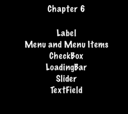

### Menu and Menu Items  菜单和菜单项
[原文 Menu and Menu Items](https://docs.cocos2d-x.org/cocos2d-x/v4/en/ui_components/menus.html) 
<br>
<br>

#### 菜单和菜单项
我们都可能熟悉什么是菜单。我们在使用的每个应用程序中都能看到它们。在你的游戏中，你可能会使用一个Menu对象来浏览游戏选项。菜单通常包含按钮，如Play、Quit、Settings和About，但也可能包含其他Menu对象，用于嵌套的菜单系统。Menu对象是一种特殊类型的Node对象。你可以创建一个空的Menu对象作为你的菜单项的占位符：<br>

```cpp
auto myMenu = Menu::create();
```

正如我们上面描述的Play、Quit、Settings和About，这些是你的菜单项。一个没有菜单项的菜单几乎没有意义。Cocos2d-x提供了多种创建菜单项的方法，包括使用Label对象或指定要显示的图像。菜单项通常有两种可能的状态，普通状态和选定状态。当你点击菜单项时，会触发一个回调。你可以把这看作是一种链式反应。你点击菜单项，它运行你指定的代码。一个菜单可以只有一个项或多个项。<br>

```cpp
// 创建一个包含单个项的菜单

// 通过指定图像创建一个菜单项
auto closeItem = MenuItemImage::create("CloseNormal.png", "CloseSelected.png",
CC_CALLBACK_1(HelloWorld::menuCloseCallback, this));

auto menu = Menu::create(closeItem, NULL);
this->addChild(menu, 1);
```

菜单也可以通过使用一个MenuItem对象的向量来创建：<br>

```cpp
// 从项目向量创建一个菜单
Vector<MenuItem*> MenuItems;

auto closeItem = MenuItemImage::create("CloseNormal.png", "CloseSelected.png",
CC_CALLBACK_1(HelloWorld::menuCloseCallback, this));

MenuItems.pushBack(closeItem);

/* 为需要的菜单项重复 */

auto menu = Menu::createWithArray(MenuItems);
this->addChild(menu, 1);
```

如果你运行本章的示例代码，你将看到一个包含MenuItems的Label对象的菜单：<br>
<br>


#### Lambda函数作为菜单回调
上面我们刚学到，当你点击菜单项时会触发一个回调。C++11提供了lambda函数，因此Cocos2d-x充分利用了它们！Lambda函数是你在源代码中内联编写的函数。Lambda函数也是在运行时而不是在编译时进行评估的。<br>

一个简单的lambda：<br>

```cpp
// 创建一个简单的Hello World lambda
auto func = [] () { cout << "Hello World"; };

// 现在在代码的某个地方调用它
func();
```

将lambda用作MenuItem回调：<br>

```cpp
auto closeItem = MenuItemImage::create("CloseNormal.png", "CloseSelected.png",
[&](Ref* sender){
    // 你的代码在这里
});
```