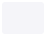
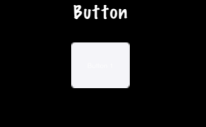

### Buttons  按钮
[原文 Buttons](https://docs.cocos2d-x.org/cocos2d-x/v4/en/ui_components/buttons.html) 
<br>
<br>

#### 按钮
我怀疑我们不需要太多解释按钮。我们都知道它们是我们在游戏中点击以触发某些操作的东西。也许你会使用按钮来切换场景或将Sprite对象添加到游戏中。按钮拦截触摸事件并在轻按时调用预定义的回调。按钮有正常和选定两种状态。按钮的外观可以根据其状态而改变。创建按钮并定义其回调很简单，确保包含 "ui/CocosGUI.h"：<br>

```cpp
auto button = Button::create("normal_image.png", "selected_image.png", "disabled_image.png");

button->setTitleText("Button Text");

button->addTouchEventListener([&](Ref* sender, Widget::TouchEventType type){
        switch (type)
        {
                case ui::Widget::TouchEventType::BEGAN:
                        break;
                case ui::Widget::TouchEventType::ENDED:
                        std::cout << "Button 1 clicked" << std::endl;
                        break;
                default:
                        break;
        }
});

this->addChild(button);
```

正如你在上面的例子中看到的，我们为按钮可能的每个状态指定了一个 .png 图像。按钮由三个图形组成，可能看起来像这样：<br>
<br>
    

在屏幕上，按钮可能看起来像这样：<br>
<br>