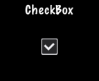

### CheckBox  复选框
[原文 CheckBox](https://docs.cocos2d-x.org/cocos2d-x/v4/en/ui_components/checkboxes.html) 
<br>
<br>

我们都习惯在纸质表格上填写复选框，比如工作申请和租赁协议。你也可以在游戏中使用复选框。也许，你希望玩家能够做出简单的是或否选择。你可能也会听到这被称为二进制选择（0 和 1）。CheckBox 允许用户做出这种类型的选择。CheckBox 有 5 种不同的状态：正常、选定和禁用。创建 CheckBox 很简单：<br>

```cpp
#include "ui/CocosGUI.h"

auto checkbox = CheckBox::create("check_box_normal.png",
                                 "check_box_normal_press.png",
                                 "check_box_active.png",
                                 "check_box_normal_disable.png",
                                 "check_box_active_disable.png");

checkbox->addTouchEventListener([&](Ref* sender, Widget::TouchEventType type){
        switch (type)
        {
                case ui::Widget::TouchEventType::BEGAN:
                        break;
                case ui::Widget::TouchEventType::ENDED:
                        std::cout << "checkbox 1 clicked" << std::endl;
                        break;
                default:
                        break;
        }
});

this->addChild(checkbox);
```

正如你在上面的例子中看到的，我们为 CheckBox 可能的每个状态指定了一个 .png 图像。由于 CheckBox 可能有 5 种状态，因此它最多有 5 个图形，分别对应其每个状态。示例图形：<br>
<br>
    

在屏幕上，复选框可能看起来像这样：<br>
<br>