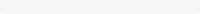
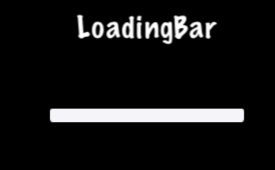

### LoadingBar 进度条
[原文 LoadingBar](https://docs.cocos2d-x.org/cocos2d-x/v4/en/ui_components/loading_bar.html) 
<br>
<br>

你玩过等待游戏加载所需内容的游戏吗？它可能会显示一个进度条，随着任务的完成而填充。这通常被称为进度条`progress bar`、状态条`status bar`或加载条`loading bar`。创建 LoadingBar：<br>

```cpp
#include "ui/CocosGUI.h"

auto loadingBar = LoadingBar::create("LoadingBarFile.png");

// 设置加载条进度的方向
loadingBar->setDirection(LoadingBar::Direction::RIGHT);

this->addChild(loadingBar);
```

在上面的例子中，创建了一个加载条，并设置了它在进行任务时应该填充的方向。在这种情况下是向右方向。然而，你可能需要更改 LoadingBar 的百分比。这很容易做到：<br>

```cpp
#include "ui/CocosGUI.h"

auto loadingBar = LoadingBar::create("LoadingBarFile.png");
loadingBar->setDirection(LoadingBar::Direction::RIGHT);

// 发生了一些事情，更改加载条的百分比
loadingBar->setPercent(25);

// 发生更多事情，再次更改百分比。
loadingBar->setPercent(35);

this->addChild(loadingBar);
```

正如你在上面的例子中看到的，我们为 LoadingBar 对象的纹理指定了一个 .png 图像：<br>
<br>
在屏幕上，加载条可能看起来像这样：<br>
<br>