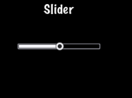

### Slider  滑块
[原文 Slider](https://docs.cocos2d-x.org/cocos2d-x/v4/en/ui_components/sliders.html) 
<br>
<br>

有时候需要微调一个值。也许你有一个角色，你想要让玩家调整对敌人的攻击强度。滑块允许用户通过移动一个指示器来设置一个值。创建 Slider：<br>

```cpp
#include "ui/CocosGUI.h"

auto slider = Slider::create();
slider->loadBarTexture("Slider_Back.png"); // 滑块的外观
slider->loadSlidBallTextures("SliderNode_Normal.png", "SliderNode_Press.png", "SliderNode_Disable.png");
slider->loadProgressBarTexture("Slider_PressBar.png");

slider->addTouchEventListener([&](Ref* sender, Widget::TouchEventType type){
        switch (type)
        {
                case ui::Widget::TouchEventType::BEGAN:
                        break;
                case ui::Widget::TouchEventType::ENDED:
                        std::cout << "slider moved" << std::endl;
                        break;
                default:
                        break;
        }
});

this->addChild(slider);
```

在上面的例子中，我们为滑块可能的每个状态指定了一个 .png 图像。一个 Slider 由 5 个图形组成，可能是这样的：<br>
<br>
在屏幕上，滑块可能看起来像这样：<br>
<br>