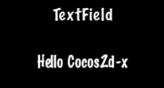

### TextField 文本框
[原文 TextField](https://docs.cocos2d-x.org/cocos2d-x/v4/en/ui_components/textfields.html) 
<br>
<br>

如果你希望游戏玩家输入一个特殊的名字来称呼主角，他们会在哪里输入呢？当然是文本字段。TextField 小部件用于输入文本。它支持触摸事件、焦点、百分比定位和百分比内容大小。创建 TextField 小部件：<br>

```cpp
#include "ui/CocosGUI.h"

auto textField = TextField::create("","Arial",30);

textField->addTouchEventListener([&](Ref* sender, Widget::TouchEventType type){
                std::cout << "editing a TextField" << std::endl;
});

this->addChild(textField);
```

在这个例子中，创建了一个 TextField，并指定了一个回调。<br>

TextField 对象是多才多艺的，可以满足你所有的输入需求。你想让用户输入一个秘密密码吗？你需要限制用户输入的字符数吗？TextField 对象内建了所有这些功能以及更多！让我们看一个例子：<br>

```cpp
#include "ui/CocosGUI.h"

auto textField = TextField::create("","Arial",30);

// 启用密码输入模式
textField->setPasswordEnabled(true);

// 设置用户可以为此 TextField 输入的最大字符数
textField->setMaxLength(10);

textField->addTouchEventListener([&](Ref* sender, Widget::TouchEventType type){
                std::cout << "editing a TextField" << std::endl;
});

this->addChild(textField);
```

在屏幕上，TextField 可能看起来像这样：<br>
<br>
在编辑 TextField 时，屏幕上会弹出虚拟键盘：<br>
<br>