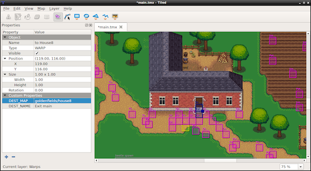

### TileMap  瓦片
[原文 TileMap](https://docs.cocos2d-x.org/cocos2d-x/v4/en/other_node_types/tilemap.html) 
<br>
<br>

TileMap是由瓦片组成的地图。每个瓦片可以具有独立的行为。TileMap以一种名为TMX的基于XML的地图格式存储。TMX最初设计用于基于瓦片的地图，但由于其对各种对象类型的支持，它也适用于更通用的游戏级别。创建TMX对象非常容易：<br>

```cpp
// 读取瓦片地图
auto map = TMXTiledMap::create("TileMap.tmx");
addChild(map, 0, 99); // 附带标签'99'
```

基于瓦片的地图可以有许多层，由z-order确定。您可以通过名称访问特定的层：<br>

```cpp
// 获取特定层的方法
auto map = TMXTiledMap::create("TileMap.tmx");
auto layer = map->getLayer("Layer0");
auto tile = layer->getTileAt(Vec2(1, 63));
```

每个瓦片都有唯一的位置和ID。这使得选择特定瓦片变得非常容易。您可以通过其ID访问任何瓦片：<br>

```cpp
// 获取特定瓦片的ID
unsigned int gid = layer->getTileGIDAt(Vec2(0, 63));
```

示例瓦片地图布局：<br>
<br>
<br>
如何制作瓦片地图？有许多工具可以做到这一点。[Tiled](http://mapeditor.org/)是一个流行的工具。它正在积极开发，并拥有强大的用户社区。上面的屏幕截图是实际的Tiled项目。<br>