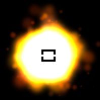
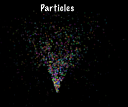

### Particle System  粒子系统
[原文 Particle System](https://docs.cocos2d-x.org/cocos2d-x/v4/en/other_node_types/particles.html) 
<br>
<br>

也许你的游戏需要像燃烧的火焰、咒语施法的视觉效果或爆炸一样的效果。如何制作这样复杂的效果？这是可能的吗？是的，可以。使用粒子系统。粒子系统这个术语指的是一种计算机图形技术，使用大量非常小的精灵或其他图形对象来模拟某些种类的模糊现象，这些现象使用传统的渲染技术很难再现。一些实际的例子可能包括高度混沌的系统、自然现象或由化学反应引起的过程。以下是一些粒子效果的示例：<br>



#### 工具用于创建粒子效果<br>
尽管你总是可以手工创建粒子效果，调整每个属性以满足你的需求。但也有一些第三方工具可用于创建粒子效果。其中一些工具包括：<br>

- Effekseer：Effekseer是一个编辑粒子效果的工具。
- Particle Designer：一个在Mac上非常强大的粒子效果编辑器。
- V-play粒子编辑器：用于Cocos2d-x的跨平台粒子编辑器。
- Particle2dx：一个在线Web粒子设计工具。

这些工具通常导出一个.plist文件，您可以在Cocos2d-x中读取，以在游戏中使用您的创作。就像我们迄今为止使用的所有其他类一样，我们使用create()方法：<br>

```cpp
// 通过.plist文件创建
auto particleSystem = ParticleSystem::create("SpinningPeas.plist");
```

#### 内置粒子效果<br>
你准备好在游戏中添加粒子效果了吗？我们希望是的！如果您还不熟悉创建自定义粒子效果，为了方便起见，有许多内置的粒子效果可供选择。看一下这个列表：<br>

- ParticleFire：点粒子系统。使用Gravity模式。
- ParticleFireworks：点粒子系统。使用Gravity模式。
- ParticleSun：点粒子系统。使用Gravity模式。
- ParticleGalaxy：点粒子系统。使用Gravity模式。
- ParticleFlower：点粒子系统。使用Gravity模式。
- ParticleMeteor：点粒子系统。使用Gravity模式。
- ParticleSpiral：点粒子系统。使用Gravity模式。
- ParticleExplosion：点粒子系统。使用Gravity模式。
- ParticleSmoke：点粒子系统。使用Gravity模式。
- ParticleSnow：点粒子系统。使用Gravity模式。
- ParticleRain：点粒子系统。使用Gravity模式。

以ParticleFireworks为例，你可以轻松使用内置效果：<br>

```cpp
auto emitter = ParticleFireworks::create();
addChild(emitter, 10);
```

结果是一个看起来像这样的粒子效果：<br>


但如果你的粒子效果还不太理想，怎么办？没错，你可以手动操纵它！让我们以同样的烟花例子为例，通过手动更改其属性来进一步操纵它：<br>

```cpp
auto emitter = ParticleFireworks::create();

// 设置持续时间
emitter->setDuration(ParticleSystem::DURATION_INFINITY);

// 半径模式
emitter->setEmitterMode(ParticleSystem::Mode::RADIUS);

// 半径模式：中心点100像素
emitter->setStartRadius(100);
emitter->setStartRadiusVar(0);
emitter->setEndRadius(ParticleSystem::START_RADIUS_EQUAL_TO_END_RADIUS);
emitter->setEndRadiusVar(0);    // start == end时不使用

addChild(emitter, 10);
```