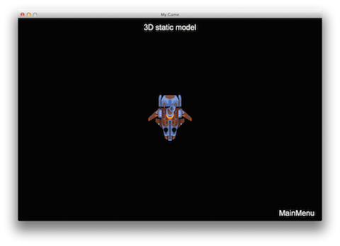
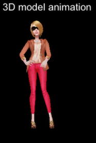

### Sprite3D  3D精灵（模型）
[原文 Sprite3D](https://docs.cocos2d-x.org/cocos2d-x/v4/en/3d/terminology.html) 
<br>
<br>


#### 3D精灵（模型）
就像2D游戏一样，3D游戏也有Sprite对象。Sprite对象是任何游戏的核心基础。Sprite和Sprite3D的主要区别之一是Sprite3D对象可以在x、y和z轴上定位。Sprite3D的工作方式与普通的Sprite非常相似。加载和显示Sprite3D对象非常简单：

```cpp
auto sprite = Sprite3D::create("boss.c3b"); //c3b文件，使用FBX转换器创建
sprite->setScale(5.f); //设置对象的缩放
sprite->setPosition(Vec2(200,200)); //设置精灵位置
scene->addChild(sprite,1); //将精灵添加到场景，z-index: 1
```

这样创建并定位了一个来自.c3b文件的Sprite3D对象。例如：<br>

<br>

现在，让我们在循环中旋转模型。为此，我们将创建一个动作并运行它：<br>

```cpp
//绕X轴旋转
auto rotation = RotateBy::create(15, Vec3(0, 360, 0));
//我们的精灵对象执行动作
sprite->runAction(RepeatForever::create(rotation));
```

要在Sprite或Sprite3D上设置锚点，请使用：

```cpp
sprite->setAnchorPoint(Point(0.0f,0.0f));
```

#### 将3D模型附加到Sprite3D对象。

回顾一下，3D模型是一组网格。您可以将3D模型附加到其他3D模型上，以创建丰富的效果。例如，为角色添加武器。为此，您需要找到要添加武器的附着点。使用`getAttachNode(attachment_point_name)`函数，然后将新模型作为子节点添加到附着点中使用`addChild()`。您可以将此视为将多个较简单的3D模型组合以创建更复杂模型的过程。例如，将模型添加到Sprite3D对象：

```cpp
auto sp = Sprite3D::create("axe.c3b");
sprite->getAttachNode("Bip001 R Hand")->addChild(sp);
```
 <br>

#### 交换3D模型。

在进行3D开发时，您可能希望对模型进行动态更改。这可能是由于道具升级、更换服装或者通过视觉提示向用户通知模型状态更改。如果您的3D模型由网格组成，可以使用`getMeshByIndex()`和`getMeshByName()`访问网格数据。使用这些函数，可以实现例如更换角色的武器或服装的效果。让我们看一个例子，一个女孩穿着外套：<br>
<br>

```cpp
auto sprite = Sprite3D::create("ReskinGirl.c3b");

// 显示第一件外套
auto girlTop0 = sprite->getMeshByName("Girl_UpperBody01");
girlTop0->setVisible(true);

auto girlTop1 = sprite->getMeshByName("Girl_UpperBody02");
girlTop1->setVisible(false);

// 切换到第二件外套
girlTop0->setVisible(false);
girlTop1->setVisible(true);
```

结果：<br>
<br>
