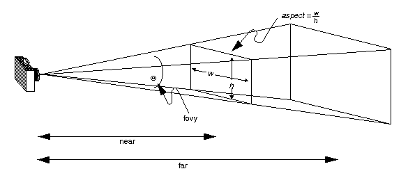
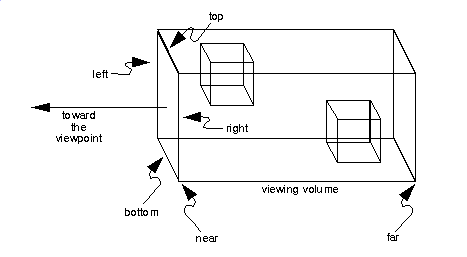

### Camera  摄像机
[原文 Camera](https://docs.cocos2d-x.org/cocos2d-x/v4/en/3d/camera.html) 
<br>
<br>

#### 摄像机
摄像机（Camera）对象是3D开发中的一个重要方面。由于3D世界不是平坦的，您需要使用摄像机来查看它并在其周围导航。就像您在观看电影时，场景向左或向右移动一样。当使用摄像机对象时，应用了相同的概念。摄像机对象继承自Node，因此支持大多数相同的Action对象。有两种类型的摄像机对象：透视摄像机和正交摄像机。<br>

透视摄像机用于查看具有近到远效果的对象。透视摄像机视图可能如下所示：<br>

<br>

正如您在透视摄像机中看到的，近处的对象较大，而远处的对象较小。<br>

正交摄像机用于查看较远的对象。您可以将其视为将3D世界转换为2D表示。正交摄像机视图可能如下所示：<br>

<br>

正如您在正交摄像机中看到的，无论对象离摄像机对象有多远，它们的大小都相同。在游戏中，迷你地图通常使用正交摄像机进行渲染。另一个例子可能是俯视视图，比如在地下城风格的游戏中。<br>

#### 摄像机使用
别担心！摄像机对象可能听起来很复杂，但Cocos2d-x使它们变得很简单。在使用3D时，您无需采取任何特殊的步骤来创建摄像机对象。每个场景都会自动创建一个默认摄像机，基于Director对象的投影属性。如果您需要多个摄像机，可以使用以下代码创建一个：

```cpp
auto s = Director::getInstance()->getWinSize();
auto camera = Camera::createPerspective(60, (GLfloat)s.width/s.height, 1, 1000);

// 设置摄像机参数
camera->setPosition3D(Vec3(0, 100, 100));
camera->lookAt(Vec3(0, 0, 0), Vec3(0, 1, 0));

addChild(camera); // 将摄像机添加到场景中
```

#### 创建正交摄像机
默认摄像机是透视摄像机。如果要创建正交摄像机，只需调用：

```cpp
Camera::createOrthographic();
```

示例：

```cpp
auto s = Director::getInstance()->getWinSize();
auto camera = Camera::createOrthographic(s.width, s.height, 1, 1000);
```

#### 从摄像机隐藏对象
有时您不希望在摄像机视图中看到所有对象。从一个摄像机中隐藏对象非常简单。在Node上使用setCameraMask(CameraFlag)并在Camera上使用setCameraFlag(CameraFlag)。示例：

```cpp
// 摄像机
camera->setCameraFlag(CameraFlag::USER1);

// 节点
node->setCameraMask(CameraFlag::USER1);
```