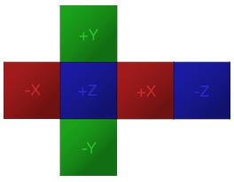

### Cubemap Texture  立方体纹理
[原文 Cubemap Texture](https://docs.cocos2d-x.org/cocos2d-x/v4/en/3d/cubemap.html) 
<br>
<br>

#### 立方体贴图纹理
一个立方体贴图纹理是由放置在虚构立方体的各个面上的六个单独的正方形纹理组成的集合。最常见的用途是在对象上显示远处的反射，类似于天空盒在背景中显示远处的风景。这是一个扩展的立方体贴图可能看起来像的例子：<br>

<br>

在Cocos2d-x中，您可以这样创建一个立方体贴图纹理：<br>

```cpp
// 使用六个纹理资源创建一个 textureCube 对象
auto textureCube = TextureCube::create("skybox/left.jpg",  "skybox/right.jpg", "skybox/top.jpg", "skybox/bottom.jpg", "skybox/front.jpg", "skybox/back.jpg");

// 设置立方体贴图纹理参数
Texture2D::TexParams tRepeatParams;
tRepeatParams.magFilter = backend::SamplerFilter::LINEAR;
tRepeatParams.minFilter = backend::SamplerFilter::LINEAR;
tRepeatParams.sAddressMode = backend::SamplerAddressMode::MIRROR_REPEAT;
tRepeatParams.tAddressMode = backend::SamplerAddressMode::MIRROR_REPEAT;
textureCube->setTexParameters(tRepeatParams);

// 创建并设置我们的自定义着色器
auto vertShader = FileUtils::getStringFromFile("cube_map.vert");
auto fragShader = FileUtils::getStringFromFile("cube_map.frag");
auto programState = new backend::ProgramState(vertShader.c_str(), fragShader.c_str());

// 将立方体贴图绑定到uniform
auto cubTexLoc = programState->getUniformLocation("u_cubeTex");
programState->setTexture(cubTexLoc, 0, textureCube->getBackendTexture());
```

这段代码中，我们首先使用六个纹理资源创建了一个`TextureCube`对象，然后设置了立方体贴图纹理的一些参数，包括过滤器和寻址模式。接着，我们从文件系统中读取了自定义的顶点着色器和片段着色器代码，并使用它们创建了一个自定义的`ProgramState`。最后，我们通过`setTexture`方法将立方体贴图纹理绑定到着色器的uniform变量上。