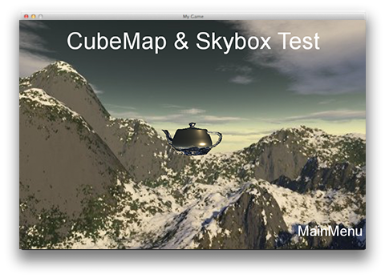

### Skybox  天空盒
[原文 Skybox](https://docs.cocos2d-x.org/cocos2d-x/v4/en/3d/skybox.html) 
<br>
<br>

#### 天空盒
Skybox是包裹整个场景的外壳，显示了几何体之外的世界是什么样子的。您可以使用Skybox来模拟无限的天空、山脉和其他现象。<br>
 <br>

创建一个Skybox：<br>

```cpp
// 创建一个Skybox对象
auto box = Skybox::create();

// 为Skybox设置textureCube
box->setTexture(_textureCube);

// 添加到场景中
_scene->addChild(box);
```

在这段代码中，我们首先创建了一个`Skybox`对象，然后通过`setTexture`方法为它设置了一个`TextureCube`对象，最后将它添加到场景中。这样，Skybox就成为了场景的背景，显示了场景外的环境。