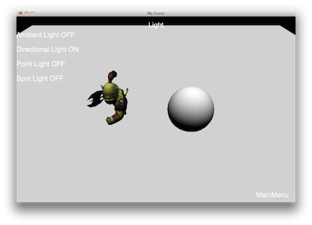
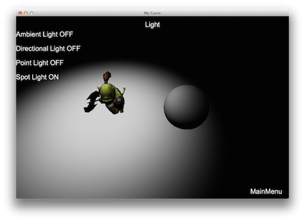

### Light  灯光
[原文 Light](https://docs.cocos2d-x.org/cocos2d-x/v4/en/3d/lighting.html) 
<br>
<br>

#### 灯光
灯光对于营造游戏的情感和氛围非常重要。目前支持四种照明技术，具体的选择取决于您的需求。每种照明效果都会产生不同的结果。

#### 环境光
AmbientLight对象会均匀地为场景中的所有物体应用光照。可以将其想象为办公环境中的照明。灯光在头顶上，当您看着办公室周围的物体时，您会以相同的光看到它们。例如：<br>
<br>

```cpp
auto light = AmbientLight::create(Color3B::RED);
addChild(light);
```

#### 方向光（平行光）
DirectionalLight通常用于模拟太阳等光源。在使用DirectionalLight时，请记住它无论您与其的相对位置如何，其光密度都是相同的。还可以想象一下在阳光明媚的日子里站在户外，太阳直射下来。当您直接朝着太阳看时，即使您在任何方向移动几步，光也是强烈的。例如：<br>
<br>

```cpp
auto light = DirectionLight::create(Vec3(-1.0f, -1.0f, 0.0f), Color3B::RED);
addChild(light);
```

#### 点光源
PointLight通常用于模拟灯泡、台灯或火炬的效果。PointLight的方向是从光照位置到PointLight的方向。请记住，与PointLight的距离有关的是光密度不同。这是什么意思呢？如果您离PointLight的起始位置很近，它将非常强烈。如果您靠近PointLight的末尾，它将变暗。PointLight在投影的距离越大，光也越弱。例如：<br>
<br>

```cpp
auto light = PointLight::create(Vec3(0.0f, 0.0f, 0.0f), Color3B::RED, 10000.0f);
addChild(light);
```

#### 聚光灯
SpotLight对象通常用于模拟手电筒。这意味着它在锥形的形状中只发出一个方向的光。想象一下你家里断电了。您可能需要拿着手电筒下到地下室重置电路。手电筒产生一个锥形状的照明模式，您只能看到该锥形模式内的物体。另一个例子是在黑暗的地牢游戏中，你的路径是由火炬照亮的。您只能看到这些火炬发出的有限锥形形状。例如：<br>


```cpp
auto spotLight = SpotLight::create(Vec3(-1.0f, -1.0f, 0.0f), Vec3(0.0f, 0.0f, 0.0f),
Color3B::RED, 0.0, 0.5, 10000.0f);
addChild(spotLight);
```

#### 光遮罩
在厨房或客厅中，您会使用什么样的灯光？可能是几盏灯吧？您是否注意到也许您只使用一盏灯来照亮房间的某一部分？您实际上正在应用一种灯光遮罩！

灯光遮罩用于在Node上只应用特定的光源。例如，如果在场景中有多个光源，Node只能被其中一个光源照亮，而不是所有三个光源。您可以使用`setLightFlag(LightFlag)`来控制哪些Node对象受到光的影响。需要注意的是，所有光源在单次渲染中都会被渲染。由于移动平台性能问题，不建议使用多个光源。默认的最大光源数为1。如果要打开多个光源，必须在info.plist中定义以下键：

```xml
<key>cocos2d.x.3d.max_dir_light_in_shader</key>
<integer>1</integer>
<key>cocos2d.x.3d.max_point_light_in_shader</key>
<integer>1</integer>
<key>cocos2d.x.3d.max_spot_light_in_shader</key>
<integer>1</integer>
```