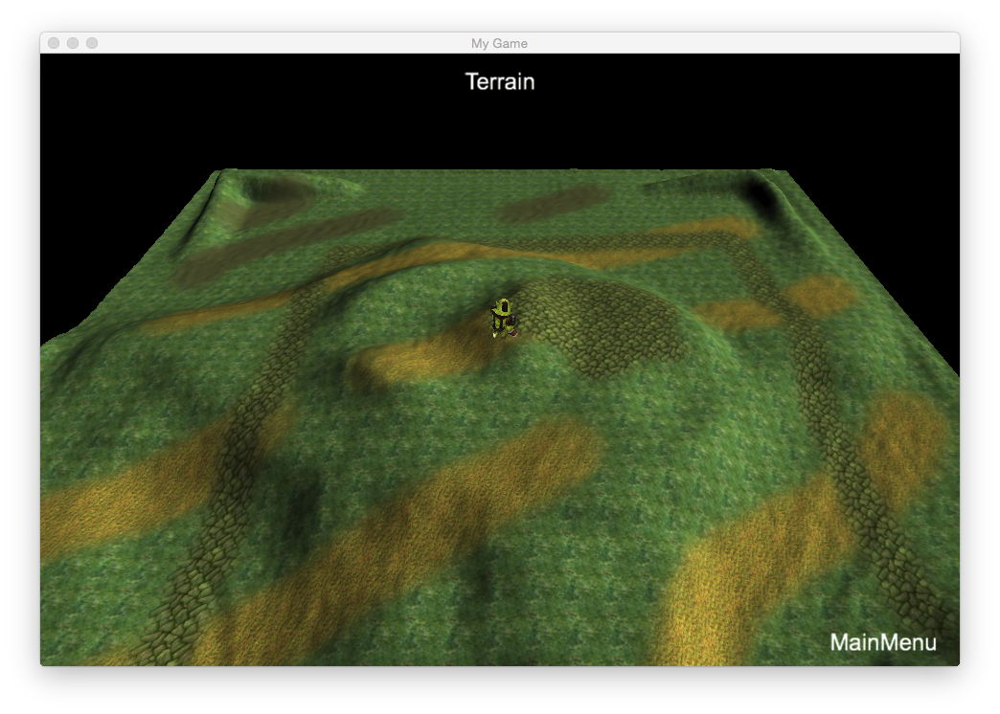

### Terrain  地形
[原文 Terrain](https://docs.cocos2d-x.org/cocos2d-x/v4/en/3d/terrain.html) 
<br>
<br>

#### 地形
地形在3D游戏中是一个重要的组件。一张纹理用于代表高度图，最多可以使用4张纹理来混合地形的细节，如草地、道路等。

- **HeightMap（高度图）：** 
HeightMap对象是地形的核心。与普通图像不同，高度图代表顶点的高度，决定了地形的几何形状。

- **DetailMap（细节图）：** 
DetailMap对象是一组纹理，确定地形的细节。最多可以使用四张纹理。

- **AlphaMap（混合图）：** 
AlphaMap对象是一张图像，其数据表示细节图的混合权重。混合的结果是最终地形的外观。

- **LOD策略：** 
地形使用一种叫做Level Of Detail（LOD）的优化技术。这是一种渲染技术，随着物体与摄像机的距离增加，减少渲染的顶点数（或三角形数）。用户可以通过调用Terrain::setLODDistance(float lod1, float lod2, float lod3)方法设置到摄像机的距离。

- **相邻地形块的裂缝伪影：** 
相邻具有不同LOD的地形块可能导致裂缝伪影。Terrain提供两个函数以避免这种情况：Terrain::CrackFixedType::SKIRT和Terrain::CrackFixedType::INCREASE_LOWER。SKIRT会在每个地形块的边缘生成四个类似裙摆的网格，而INCREASE_LOWER会动态调整每个地形块的索引以无缝连接它们。

- **创建地形的步骤：**
   1. 创建一个玩家并将其放置在地形上，例如：
      ```cpp
      auto player = Sprite3D::create("chapter9/orc.c3b");
      player->setScale(0.08);
      player->setPositionY(terrain->getHeight(player->getPositionX(), player->getPositionZ()));
      ```
    

   2. 创建所有DetailMap对象（最多四个），将它们传递给Terrain::DetailMap结构，例如：
      ```cpp
      Terrain::DetailMap r("dirt.dds");
      Terrain::DetailMap g("grass.dds");
      Terrain::DetailMap b("road.dds");
      Terrain::DetailMap a("greenSkin.jpg");
      ```
   3. 使用细节图创建TerrainData变量，指定地形的高度图文件路径和AlphaMap文件路径，例如：
      ```cpp
      Terrain::TerrainData data("chapter9/heightmap16.jpg", "TerrainTest/alphamap.png", r, g, b, a);
      ```
   4. 将TerrainData对象传递给Terrain::create，最后一个参数确定LOD策略，例如：
      ```cpp
      _terrain = Terrain::create(data, Terrain::CrackFixedType::SKIRT);
      ```
   5. 如果设置了Terrain对象的相机掩码并将其添加到Node或Scene中，请注意：当Terrain添加到Node或Scene中后，不能再对其进行transform（平移、缩放）。如果在调用addChild()后执行此操作，可能会导致地形的一些方法计算错误的结果。

- **获取地形高度：** 
使用`Terrain::getHeight(float x, float z, Vec3 * normal = nullptr)`方法获取指定位置的高度。这在想要将Sprite3D对象或任何Node放在地形表面时非常有用。

- **射线-地形相交测试：** 
射线-地形相交测试将计算给定位置的相交点。

- **避免裂缝伪影：**
   - `Terrain::CrackFixedType::SKIRT` 会在每个地形块的边缘生成类似裙摆的四个网格。
   - `Terrain::CrackFixedType::INCREASE_LOWER` 会动态调整每个地形块的索引，使它们无缝连接。