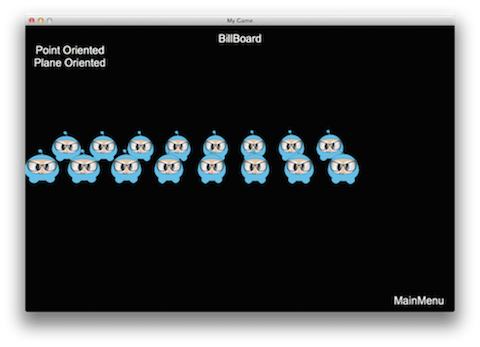
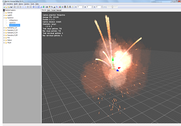
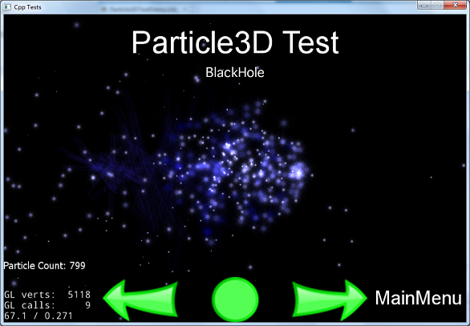

### Advanced Topics  高级主题
[原文 Advanced Topics](https://docs.cocos2d-x.org/cocos2d-x/v4/en/3d/advanced.html) 
<br>
<br>

#### 高级主题

**BillBoard（广告牌）：**
你可能以前没听说过BillBoard。不，我不是在说高速公路旁边的广告。相反，BillBoard是一种特殊的Sprite，它始终面向摄像机。随着摄像机的旋转，BillBoard对象也会旋转。在渲染技术中，使用BillBoard是一种非常常见的技术。例如，下坡滑雪游戏中，挡住滑雪者视线的树木、岩石或其他物体都是BillBoard对象。 <br>
 <br>
BillBoard对象很容易创建。BillBoard派生自Sprite，因此它支持大多数Sprite对象的功能。我们可以使用以下create方法创建一个：<br>

```cpp
auto billboard = BillBoard::create("Blue_Front1.png", BillBoard::Mode::VIEW_POINT_ORIENTED);
```

你还可以通过更改BillBoard对象的模式，为相机的XOY平面（如地板的平面）创建BillBoard对象：<br>

```cpp
auto billboard = BillBoard::create("Blue_Front1.png", BillBoard::Mode::VIEW_PLANE_ORIENTED);
```

这些create方法看起来有点不同，因为传入了BillBoard::Mode的附加参数。有两种BillBoard::Mode类型，VIEW_POINT_ORIENTED和VIEW_PLANE_ORIENTED。

VIEW_POINT_ORIENTED是BillBoard对象相对于摄像机的定向。示例：<br>

<br>

VIEW_PLANE_ORIENTED是BillBoard相对于摄像机的XOY平面定向。示例：<br>

<br>

你还可以像其他Node一样为BillBoard设置属性。这些包括但不限于：缩放、位置、旋转。示例：<br>

```cpp
billboard->setScale(0.5f);
billboard->setPosition3D(Vec3(0.0f, 0.0f, 0.0f));
billboard->setBlendFunc(BlendFunc::ALPHA_NON_PREMULTIPLIED);
addChild(billboard);
```

**ParticleSystem3D（3D粒子系统）：**
在第7章，你学到了关于2D粒子以及如何使用它们。当你使用3D时，你可能还想使用3D粒子系统来获得丰富的高级效果。许多与2D粒子系统相同的概念也适用于3D粒子系统。Cocos2d-x目前支持Particle Universe（//www.fxpression.com/）用于粒子系统构建。Particle Universe提供了一个特殊的粒子编辑器，允许您快速轻松地设置各种效果，如爆炸、火灾、血液和其他特殊效果。此编辑器在保存或导出时使用pu文件扩展名。 <br>

当你对粒子感到满意并准备在代码中使用它时，仅导出到其内置的pu格式就足够了！Cocos2d-x直接支持这个格式。此外，PUParticleSystem3D是专门用于处理Particle Universe粒子的对象类型。PUParticleSystem3D提供两种创建粒子的方式。<br>

第一种方式是通过传入Particle Universe文件和其对应的材质文件来构建粒子。还记得第7章中提到的材质文件是描述粒子的文件。这是必需的。示例：<br>

```cpp
auto ps = PUParticleSystem3D::create("lineStreak.pu", "pu_mediapack_01.material");
ps->startParticleSystem();
this->addChild(ps);
```

第二种方式是仅通过传递一个粒子宇宙文件来构建粒子系统。当你以这种方式创建一个粒子时，除了加载粒子外，与粒子文件相同文件夹中的所有材质文件将自动加载。这是一个例子：<br>

```cpp
auto ps = PUParticleSystem3D::create("electricBeamSystem.pu");
ps->startParticleSystem();
this->addChild(ps);
```

注意：使用这种方法会导致加载时间增加并且消耗更多内存，因为会加载所有内容。如果你知道要使用哪种材质并且不需要加载所有内容，使用第一种方法会更好。<br>
 
 <br>
一旦有了粒子，你可以以相当明显的方式与它进行交互。你可以作为一个整体与粒子系统交互，启动、停止、暂停、恢复以及获取粒子的总数：

```cpp
virtual void startParticleSystem() override;
virtual void stopParticleSystem() override;
virtual void pauseParticleSystem() override;
virtual void resumeParticleSystem() override;
virtual int getAliveParticleCount() const override;
```

由于PUParticleSystem3D派生自Node，因此你可以在粒子上运行Action和Sequence对象！示例：

```cpp
auto ps = PUParticleSystem3D::create("blackHole.pu", "pu_mediapack_01.material");
ps->setPosition(-25.0f, 0.0f);

auto moveby = MoveBy::create(2.0f, Vec2(50.0f, 0.0f));
auto moveby1 = MoveBy::create(2.0f, Vec2(-50.0f, 0.0f));

ps->runAction(RepeatForever::create(Sequence::create(moveby, moveby1, nullptr)));
ps->startParticleSystem();
```

结合Action和Sequence对象可能会产生有趣的黑洞效果：



与其他3D对象一样，你还可以使用AttachNode组合3D对象。这允许创建丰富的模型。示例：

```cpp
auto sprite3d = Sprite3D::create("orc.c3b");
sprite3d->setPosition3D(Vec3(0.0f, 0.0f, 0.0f));
sprite3d->setRotation3D(Vec3(0.0f, 180.0f, 0.0f));

auto animation = Animation3D::create("orc.c3b");
if (animation)
{
    auto animate = Animate3D::create(animation);
    sprite3d->runAction(RepeatForever::create(animate));
}

auto handler = PUParticleSystem3D::create("lightningBolt.pu");
handler->startParticleSystem();
sprite3d->getAttachNode("Bip001 L Hand")->addChild(handler);

this->addChild(sprite3d);
```
