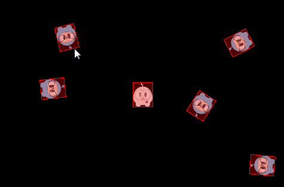

### Physics terminology and concepts  物理学术语和概念
[原文 Physics terminology and concepts](https://docs.cocos2d-x.org/cocos2d-x/v4/en/physics/concepts.html) 
<br>
<br>

#### 物理学术语和概念
为了更好地理解物理引擎的所有细节，您应该了解以下术语和概念：

**Bodies（物体）**
PhysicsBody 包含对象的物理属性，包括质量、位置、旋转、速度和阻尼。PhysicsBody 对象是形状的基础。一个 PhysicsBody 在附加形状之前是没有形状的。

**Material（材质）**
材质描述了材质属性：

- density（密度）：用于计算父体的质量属性。
- restitution（恢复力）：用于使对象反弹。恢复值通常设置在 0 和 1 之间。0 表示没有弹跳，而 1 表示完美弹跳。
- friction（摩擦力）：用于使对象沿着彼此滑动，以实现逼真的效果。

**Shapes（形状）**
形状描述了碰撞几何。通过将形状附加到物体，您定义了物体的形状。您可以附加多个形状到单个物体，以定义复杂的形状。每个形状与 PhysicsMaterial 对象相关联，包含以下属性：type、area、mass、moment、offset 和 tag。您可能对其中一些不熟悉：

- type：描述形状的类别，例如圆、矩形、多边形等。
- area：用于计算物体的质量属性。密度和面积确定了质量。
- mass：物体包含的物质量，由其在给定力下的加速度或由重力场对其施加的力来衡量。
- moment：确定实现所需角加速度所需的扭矩。
- offset：相对于物体局部坐标中心的偏移。
- tag：用于为开发人员轻松识别形状。

我们描述了各种形状，如：

- PhysicsShape：形状实现 PhysicsShape 基类。
- PhysicsShapeCircle：圆形状是实心的。不能使用圆形状创建空心圆。
- PhysicsShapePolygon：多边形形状是实心的凸多边形。
- PhysicsShapeBox：矩形形状是一种凸多边形。
- PhysicsShapeEdgeSegment：线段形状。
- PhysicsShapeEdgePolygon：空心多边形形状，由多个线段形状组成。
- PhysicsShapeEdgeBox：空心矩形形状，由四个线段形状组成。
- PhysicsShapeEdgeChain：链形状提供了连接多条边的有效方法。

**Contacts/Joints（接触/关节）**
接触和关节对象描述了物体如何连接在一起。

**World（世界）**
世界容器是您的物理体被添加到的地方，也是它们被模拟的地方。您将物体、形状和约束添加到世界中，然后将世界作为一个整体进行更新。世界控制所有这些项目之间的交互。与物理 API 的许多交互都将使用 PhysicsWorld 对象。

有很多需要记住的东西，请将这些术语随时准备好，以在需要时进行参考。

**Physics World 和 Physics Body（物理世界和物理体）**
**PhysicsWorld（物理世界）**
PhysicsWorld 对象是模拟物理时使用的核心项目。就像我们生活的世界一样，PhysicsWorld 同时发生很多事情。PhysicsWorld 在场景级别深度集成，因为它有许多方面。让我们使用一个我们都能够理解的简单例子。您的住所是否有厨房？把这看作是您的物理世界！现在您的世界有 PhysicsBody 对象，比如食物、刀具、电器！这些物体在世界内相互交互。这些对象接触，并且还对这些

触摸作出反应。例如：使用刀具切割食物并将其放入电器中。刀子切割了食物吗？也许。也许不。也许它不是工作的正确类型的刀具。

您可以通过在场景中调用 initWithPhysics() 函数来创建包含 PhysicsWorld 的场景。您的 init() 函数应该包含：

```cpp
if (!Scene::initWithPhysics())
{

}
```

每个 PhysicsWorld 都有与之关联的属性：

- gravity（重力）：应用于世界的全局重力。默认为 Vec2(0.0f, -98.0f)。
- speed（速度）：设置物理世界的速度，速度是模拟执行的速率。默认为 1.0。
- updateRate（更新率）：设置物理世界的更新率，更新率是 EngineUpdateTimes/PhysicsWorldUpdateTimes 的值。
- substeps（子步骤）：设置物理世界更新中的子步骤数。

更新 PhysicsWorld 的过程称为步进。默认情况下，PhysicsWorld 通过时间自动更新。这称为自动步进。它会在每帧自动发生。您可以通过设置 setAutoStep(false) 来禁用 PhysicsWorld 的自动步进。如果这样做，您将手动步进 PhysicsWorld，通过设置 step(time)。子步骤用于使用比单帧更精确的时间增量将 PhysicsWorld 向前推进多次。这允许更精细的控制步进过程，包括更流畅的运动。

**PhysicsBody（物理体）**
PhysicsBody 对象具有位置和速度。您可以向 PhysicsBody 对象应用力、运动、阻尼和冲量（以及更多）。PhysicsBody 可以是静态或动态的。静态体在模拟下不会移动，并表现为具有无限质量的体。动态体完全模拟。它们可以由用户手动移动，但通常根据力移动。动态体可以与所有体类型发生碰撞。Node 提供 setPhysicsBody()，将 PhysicsBody 关联到 Node 对象。

让我们创建一个静态和 5 个动态的 PhysicsBody 对象，它们是矩形形状：

```cpp
auto visibleSize = Director::getInstance()->getVisibleSize();
s_centre = Vec2(visibleSize.width/2, visibleSize.height/2);

auto physicsBody = PhysicsBody::createBox(Size(65.0f, 81.0f),
                        PhysicsMaterial(0.1f, 1.0f, 0.0f));
physicsBody->setDynamic(false);

// 创建一个精灵
auto sprite = Sprite::create("whiteSprite.png");
sprite->setPosition(s_centre);
addChild(sprite);

// 将 physicsBody 应用到精灵
sprite->addComponent(physicsBody);

// 添加五个动态体
for (int i = 0; i < 5; ++i)
{
    physicsBody = PhysicsBody::createBox(Size(65.0f, 81.0f),
                    PhysicsMaterial(0.1f, 1.0f, 0.0f));

    // 设置物体不受物理世界的重力影响
    physicsBody->setGravityEnable(false);

    // 设置 physicsBody 的初始速度
    physicsBody->setVelocity(Vec2(cocos2d::random(-500,500),
                cocos2d::random(-500,500)));
    physicsBody->setTag(10);

    sprite = Sprite::create("blueSprite.png");
    sprite->setPosition(Vec2(s_centre.x + cocos2d::random(-300,300),
                s_centre.y + cocos2d::random(-300,300)));
    sprite->addComponent(physicsBody);

    addChild(sprite);
}
```

结果是一个静止的 PhysicsBody 和另外 5 个在其周围碰撞的动态 PhysicsBody 对象。<br>

