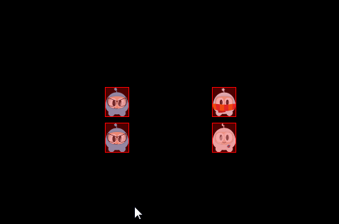
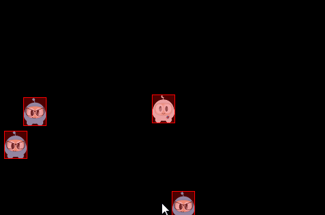

### Collision  碰撞器
[原文 Collision](https://docs.cocos2d-x.org/cocos2d-x/v4/en/physics/collisions.html) 
<br>
<br>

#### 碰撞
你有没有参与过车祸？你碰到了什么？就像汽车一样，PhysicsBody 对象也可以发生接触。碰撞是指当 PhysicsBody 对象彼此接触时发生的情况。发生碰撞时，可以选择忽略它，也可以触发事件。

#### 过滤碰撞
碰撞过滤允许您启用或阻止形状之间的碰撞。此物理引擎支持使用类别和组位掩码进行碰撞过滤。<br>

支持 32 个碰撞类别。对于每个形状，您可以指定它属于哪个类别。您还可以指定该形状可以与哪些其他类别发生碰撞。这是通过掩码位来完成的。例如：<br>

```cpp
auto visibleSize = Director::getInstance()->getVisibleSize();
s_centre = Vec2(visibleSize.width/2, visibleSize.height/2);

auto sprite1 = addSpriteAtPosition(Vec2(s_centre.x - 150,s_centre.y));
sprite1->getPhysicsBody()->setCategoryBitmask(0x02);    // 0010
sprite1->getPhysicsBody()->setCollisionBitmask(0x01);   // 0001

sprite1 = addSpriteAtPosition(Vec2(s_centre.x - 150,s_centre.y + 100));
sprite1->getPhysicsBody()->setCategoryBitmask(0x02);    // 0010
sprite1->getPhysicsBody()->setCollisionBitmask(0x01);   // 0001

auto sprite2 = addSpriteAtPosition(Vec2(s_centre.x + 150,s_centre.y),1);
sprite2->getPhysicsBody()->setCategoryBitmask(0x01);    // 0001
sprite2->getPhysicsBody()->setCollisionBitmask(0x02);   // 0010

auto sprite3 = addSpriteAtPosition(Vec2(s_centre.x + 150,s_centre.y + 100),2);
sprite3->getPhysicsBody()->setCategoryBitmask(0x03);    // 0011
sprite3->getPhysicsBody()->setCollisionBitmask(0x03);   // 0011
```

您可以通过检查和比较类别和碰撞位掩码来检查碰撞，如：

```cpp
if ((shapeA->getCategoryBitmask() & shapeB->getCollisionBitmask()) == 0
   || (shapeB->getCategoryBitmask() & shapeA->getCollisionBitmask()) == 0)
{
   // shapes can't collide
   ret = false;
}
```


碰撞组允许您指定一个整数组索引。您可以使所有具有相同组索引的形状始终发生碰撞（正索引）或永远不发生碰撞（负索引和零索引）。具有不同组索引的形状之间的碰撞根据类别和掩码位进行过滤。换句话说，组过滤的优先级高于类别过滤。

#### 接触/关节
从上面的术语中回忆，关节是联系点如何连接在一起的方式。是的，您可以将其视为您身体上的关节。每种关节类型都有一个从 PhysicsJoint 派生的定义。所有关节都连接在两个不同的物体之间。一个物体可能是静态的。您可以通过 joint->setCollisionEnable(false) 防止连接的物体彼此碰撞。许多关节定义要求您提供一些几何数据。通常，通过锚点定义关节。关节定义数据的其余部分取决于关节类型。

- PhysicsJointFixed: 固定关节将两个物体在一个参考点上融合在一起。固定关节对于创建稍后可以分解的复杂形状非常有用。

- PhysicsJointLimit: 限制关节对两个物体施加最大距离，就像它们被绳子连接一样。

- PhysicsJointPin: 针关节允许两个物体在锚点周围独立旋转，就像被一起固定一样。

- PhysicsJointDistance: 设置两个物体之间的固定距离。

- PhysicsJointSpring: 使用弹簧将两个物理体连接在一起。

- PhysicsJointGroove: 将 body a 附加到一条线上，并将 body b 附加到一个点上。

- PhysicsJointRotarySpring: 类似于弹簧关节，但是用于旋转。

- PhysicsJointRotaryLimit: 类似于限制关节，但是用于旋转。

- PhysicsJointRatchet: 类似于扳手。

- PhysicsJointGear: 保持一对物体的角速度比恒定。

- PhysicsJointMotor: 保持一对物体的相对角速度恒定。


#### 碰撞检测
接触是由物理引擎创建的对象，用于管理两个形状之间的碰撞。接触对象不是由用户创建的，它们是自动创建

的。与接触相关联的有一些术语。

- 接触点：两个形状接触的点。

- 接触法线：接触法线是一个指向一个形状到另一个形状的单位向量。

您可以从接触中获取 PhysicsShape。从中，您可以获取物体。

```cpp
bool onContactBegin(PhysicsContact& contact)
{
    auto bodyA = contact.getShapeA()->getBody();
    auto bodyB = contact.getShapeB()->getBody();
    return true;
}
```

通过实现接触监听器，您可以获取接触的访问权限。接触监听器支持几个事件：开始（begin）、预处理（pre-solve）、后处理（post-solve）和分离（separate）。

- begin：两个形状在这一步中刚刚开始首次接触。从回调中返回 true 以正常处理碰撞，或返回 false 以使物理引擎完全忽略碰撞。如果返回 false，则 preSolve() 和 postSolve() 回调将永远不会运行，但在形状停止重叠时仍将收到分离事件。

- pre-solve：两个形状在这一步中接触。从回调中返回 false 以使物理引擎在这一步中忽略碰撞，或返回 true 以正常处理。此外，您可以使用 setRestitution()、setFriction() 或 setSurfaceVelocity() 覆盖碰撞值，以提供自定义的恢复、摩擦或表面速度值。

- post-solve：两个形状接触并且它们的碰撞响应已经被处理。

- separate：两个形状刚刚在这一步中首次停止接触。

您还可以使用 EventListenerPhysicsContactWithBodies、EventListenerPhysicsContactWithShapes、EventListenerPhysicsContactWithGroup 来监听您感兴趣的带有物体、形状或组的事件。此外，您还需要设置与物理接触相关的位掩码值，因为默认情况下将不会接收到接触事件，即使创建了相关的 EventListener。

例如：

```cpp
bool init()
{
    auto visibleSize = Director::getInstance()->getVisibleSize();
    s_centre = Vec2(visibleSize.width/2, visibleSize.height/2);

    // 创建一个静态 PhysicsBody
    auto sprite = addSpriteAtPosition(s_centre, 1);
    sprite->setTag(10);
    sprite->getPhysicsBody()->setContactTestBitmask(0xFFFFFFFF);
    sprite->getPhysicsBody()->setDynamic(false);

    // 添加接触事件监听器
    auto contactListener = EventListenerPhysicsContact::create();
    contactListener->onContactBegin = CC_CALLBACK_1(PhysicsDemoCollisionProcessing::onContactBegin, this);
    _eventDispatcher->addEventListenerWithSceneGraphPriority(contactListener, this);

    schedule(CC_SCHEDULE_SELECTOR(PhysicsDemoCollisionProcessing::tick), 0.3f);
    return true;

    return false;
}

void tick(float dt)
{
    auto sprite1 = addSpriteAtPosition(Vec2(s_centre.x + cocos2d::random(-300,300),
      s_centre.y + cocos2d::random(-300,300)));
    auto physicsBody = sprite1->getPhysicsBody();
    physicsBody->setVelocity(Vec2(cocos2d::random(-500,500),cocos2d::random(-500,500)));
    physicsBody->setContactTestBitmask(0xFFFFFFFF);
}

bool onContactBegin(PhysicsContact& contact)
{
    auto nodeA = contact.getShapeA()->getBody()->getNode();
    auto nodeB = contact.getShapeB()->getBody()->getNode();

    if (nodeA && nodeB)
    {
        if (nodeA->getTag() == 10)
        {
            nodeB->removeFromParentAndCleanup(true);
        }
        else if (nodeB->getTag() == 10)
        {
            nodeA->removeFromParentAndCleanup(true);
        }
    }

    // 物体可以发生碰撞
    return true;
}
```

