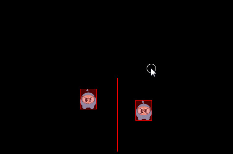
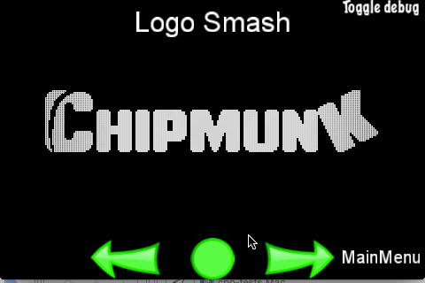

### Queries  查询
[原文 Queries](https://docs.cocos2d-x.org/cocos2d-x/v4/en/physics/queries.html) 
<br>
<br>

#### 查询
你有没有站在一个地方四处看？你会看到离你近的和远的事物。你可以估计事物离你有多近。物理引擎提供了这种类型的空间查询。PhysicsWorld 对象目前支持点查询、射线查询和矩形查询。

#### 点查询
当你触摸某样东西，比如你的桌子，你可以将这看作是一个点查询。点查询允许你检查是否有形状在某点的一定距离内。点查询对于鼠标拾取和简单的传感器非常有用。你还可以找到距离给定点最近的形状或找到距离某点最近的形状。

#### 射线查询
如果你四处看，你的视线范围内肯定有一些东西能引起你的注意。在这里，你实际上进行了一次射线查询。你扫描直到找到一些有趣的东西让你停下扫描。你可以对一个形状进行射线查询，以获取第一次相交的点。例如：

```cpp
void tick(float dt)
{
    Vec2 d(300 * cosf(_angle), 300 * sinf(_angle));
    Vec2 point2 = s_centre + d;
    if (_drawNode)
    {
        removeChild(_drawNode);
    }
    _drawNode = DrawNode::create();

    Vec2 points[5];
    int num = 0;
    auto func = [&points, &num](PhysicsWorld& world,
        const PhysicsRayCastInfo& info, void* data)->bool
    {
        if (num < 5)
        {
            points[num++] = info.contact;
        }
        return true;
    };

    s_currScene->getPhysicsWorld()->rayCast(func, s_centre, point2, nullptr);

    _drawNode->drawSegment(s_centre, point2, 1, Color4F::RED);
    for (int i = 0; i < num; ++i)
    {
        _drawNode->drawDot(points[i], 3, Color4F(1.0f, 1.0f, 1.0f, 1.0f));
    }
    addChild(_drawNode);

    _angle += 1.5f * (float)M_PI / 180.0f;
}
```


#### 矩形查询
矩形查询提供了一种快速检查大致在一个区域内有哪些形状的方式。它相当容易实现：

```cpp
auto func = [](PhysicsWorld& world, PhysicsShape& shape, void* userData)->bool
{
    // 从回调中返回 true 以继续矩形查询
    return true;
}

scene->getPhysicsWorld()->queryRect(func, Rect(0,0,200,200), nullptr);
```

在进行标志砸碎时使用矩形查询的几个例子：<br>
<br>
<br>
