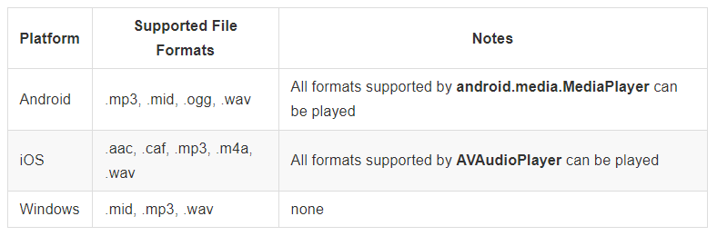
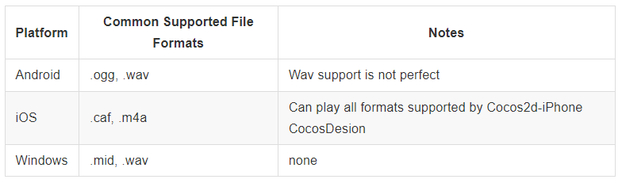

### Getting Started  开始
[原文 Getting Started](https://docs.cocos2d-x.org/cocos2d-x/v4/en/audio/getting_started.html) 
 
 

#### Getting Started
你的游戏肯定需要音效！Cocos2d-x提供了一个称为SimpleAudioEngine的音频引擎。它可以用于在整个游戏过程中播放背景音乐以及音效。SimpleAudioEngine是一个共享的单例对象，因此你可以在代码的任何地方轻松调用它。在创建一个示例HelloWorld项目时，我们已经为你完成了所有必需的设置，开箱即用。 

支持的音乐格式:  
    

支持的音频格式： 
  