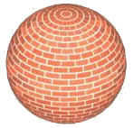
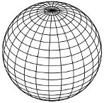
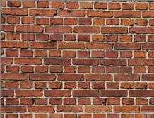

### Shaders and Materials  着色器和材质
[原文 Shaders and Materials](https://docs.cocos2d-x.org/cocos2d-x/v4/en/advanced_topics/shaders.html) 
<br>
<br>

#### 什么是着色器
根据维基百科：<br>

在计算机图形领域，着色器是一种计算机程序，用于进行着色：在图像中产生适当级别的颜色，或者在现代时代，还用于产生特殊效果或进行视频后期处理。通俗地说，它是“告诉计算机以特定而独特的方式绘制某物”的程序。<br>

换句话说，它是在GPU上（而不是CPU上）运行的一段代码，用于绘制不同的Cocos2d-x节点。<br>

Cocos2d-x使用OpenGL ES Shading Language v1.0进行着色器。但是描述GLSL语言超出了本文档的范围。要了解有关该语言的更多信息，请参阅：OpenGL ES Shading Language v1.0规范。<br>

在Cocos2d-x中，所有可渲染的Node对象都使用着色器。例如，Sprite使用优化的2D精灵着色器，Sprite3D使用优化的3D对象着色器，依此类推。<br>

#### 自定义着色器
用户可以通过调用以下方式更改任何Cocos2d-x Node的预定义着色器：<br>

``` CPP
sprite->setProgramState(programState);
sprite3d->setProgramState(programState);
```
ProgramState对象包含两个重要的内容：<br>

1. 程序：基本上就是着色器。它包含顶点和片段着色器。
2. 状态：基本上是着色器的统一变量。
如果您对统一变量的术语和其为什么需要不熟悉，请参阅[OpenGL着色器语言规范](https://www.khronos.org/files/opengles_shading_language.pdf)。<br>
<br>
将统一变量设置为ProgramState就像这样简单：

``` cpp
auto mvpMatrixLocation = _programState->getUniformLocation("u_MVPMatrix");
const auto& projectionMat = Director::getInstance()->getMatrix(MATRIX_STACK_TYPE::MATRIX_STACK_PROJECTION);
_programState->setUniform(mvpMatrixLocation, projectionMat.m, sizeof(projectionMat.m)));
```
<br>
甚至可以将回调函数设置为统一变量值：<br>

``` cpp
auto location = _programState->getUniformLocation("u_progress");
_programState->setCallbackUniform(location, [](backend::ProgramState *programState, backend::UniformLocation uniform)
{
    float random = CCRANDOM_0_1();
    programState->setUniform(uniform, &random, sizeof(random));
}
);
```
尽管可以手动设置ProgramState对象，但更简单的方法是使用材质对象。<br>

#### 什么是材质
假设你想绘制一个类似于这样的球体：<br>
<br>


首先，你必须定义其几何形状，类似于这样：<br>
<br>


...然后定义砖块纹理，类似于这样：<br>



- 但是如果您希望在球离摄像机远离时使用较低质量的纹理呢？
- 或者如果您想对砖块应用模糊效果呢？
- 或者如果您想在球体中启用或禁用光照呢？
答案是使用材质而不仅仅是简单的纹理。事实上，使用材质，您可以有多个纹理，以及更多的功能，如多通道渲染。<br>

材质对象是从.material文件创建的，其中包含以下信息：<br>

- 材质可以有一个或多个Technique对象
- 每个Technique可以有一个以上的Pass对象
- 每个Pass对象都有：
- - RenderState对象，
- - 包含uniforms的Shader对象
例如，这是一个.material文件的外观：<br>

``` glsl
// “Material”文件可以包含一个或多个材料
material spaceship
{
    // 一个Material包含一个或多个Technique。
    // 如果存在多个Technique，则第一个将是默认的Technique
    // “Technique”描述了材料将如何呈现
    // Techniques可以：
    //  - 定义模型的渲染质量：高质量，低质量等。
    //  - 照亮或不照亮对象
    // 等等...
    technique normal
    {
        // Technique可以包含一个或多个passes
        // “Pass”描述了为了实现所需的技术而需要的“绘制”
        // Passes的3个属性是着色器、渲染状态和采样器
        pass 0
        {
            // 着色器：负责顶点和片段着色器及其uniforms
            shader
            {
                vertexShader = Shaders3D/3d_position_tex.vert
                fragmentShader = Shaders3D/3d_color_tex.frag

                // uniforms，包括采样器，放在这里
                u_color = 0.9,0.8,0.7
                // 采样器：id是uniform名称
                sampler u_sampler0
                {
                    path

 = Sprite3DTest/boss.png
                    mipmap = true
                    wrapS = CLAMP
                    wrapT = CLAMP
                    minFilter = NEAREST_MIPMAP_LINEAR
                    magFilter = LINEAR
                }
            }
            // 渲染状态：负责深度缓冲区、cullface、stencil、混合等
            renderState
            {
                cullFace = true
                cullFaceSide = FRONT
                depthTest = true
            }
        }
    }
}
```
<br>
这是如何将材质设置到Sprite3D的方式：<br>

```cpp
Material* material = Material::createWithFilename("Materials/3d_effects.material");
sprite3d->setMaterial(material);
```
如果您想在不同的Technique之间切换，您必须执行：<br>

```cpp
material->setTechnique("normal");
```

#### 工艺
由于您每个Sprite3D只能绑定一个材质，因此支持了一个附加功能，旨在使在运行时快速轻松地更改渲染部分的方式。您可以通过给它们不同的名称定义多个工艺。每个工艺可以具有完全不同的渲染工艺，甚至可以在运行时使用`Material::setTechnique(const std::string& name)`更改应用的工艺。在加载材质时，所有工艺都会提前加载。这是在处理不同的光照组合或在渲染对象远离摄像机时禁用凹凸映射等较低质量的渲染工艺的实用方法。

#### 通道
一个Technique可以有一个或多个pass，即多通道渲染。每个Pass都有两个主要对象：

- RenderState：包含GPU状态信息，如depthTest、cullFace、stencilTest等。
- GLProgramState：包含将要使用的着色器（GLProgram），包括其uniforms。

#### 详细的材质文件格式
材质使用一种经过优化的文件格式来创建Material文件。这种文件格式非常类似于其他现有的Material文件格式，例如GamePlay3D和OGRE3D。<br>

注意：<br>

- Material文件扩展名无关紧要。虽然建议使用.material作为扩展名
- id对于material、technique和pass是可选的
- Material可以通过选择性地设置parent_material_id来从另一个material继承值
- Vertex和fragment着色器文件扩展名无关紧要。在Cocos2d-x中的约定是使用.vert和.frag
```cpp 
// 当.material文件包含一个材质时
sprite3D->setMaterial("Materials/box.material");
// 当.material文件包含多个材质时
sprite3D->setMaterial("Materials/circle.material#wood");
```

```
material material_id : parent_material_id	 	 
{	 	 
renderState {}	[0..1]	block
technique id {}	[0..*]	block
}	
```
``` 	 
technique technique_id	 	 
{	 	 
renderState {}	[0..1]	block
pass id {}	[0..*]	block
}	
```
``` 	 
pass pass_id	 	 
{	 	 
renderState {}	[0..1]	block
shader {}	[0..1]	block
}	
```
``` 	 
renderState	 	 
{	 	 
blend = false	[0..1]	bool
blendSrc = BLEND_ENUM	[0..1]	enum
blendDst = BLEND_ENUM	[0..1]	enum
cullFace = false	[0..1]	bool
depthTest = false	[0..1]	bool
depthWrite = false	[0..1]	bool
}	 	 
  frontFace = CW | CCW	[0..1]	enum
  depthTest = false	[0..1]	bool
  depthWrite = false	[0..1]	bool
  depthFunc = FUNC_ENUM	[0..1]	enum
  stencilTest = false	[0..1]	bool
  stencilWrite = 4294967295	[0..1]	uint
  stencilFunc = FUNC_ENUM	[0..1]	enum
  stencilFuncRef = 0	[0..1]	int
  stencilFuncMask = 4294967295	[0..1]	uint
  stencilOpSfail = STENCIL_OPERATION_ENUM	[0..1]	enum
  stencilOpDpfail = STENCIL_OPERATION_ENUM	[0..1]	enum
  stencilOpDppass = STENCIL_OPERATION_ENUM	[0..1]	enum
```

```
shadershader_id	 	 
{	 	 
vertexShader = res/colored.vert	[0..1]	file path
fragmentShader = res/colored.frag	[0..1]	file path
defines = semicolon separated list	[0..1]	string
 	 	 
uniform_name = scalar | vector	[0..*]	uniform
uniform_name = AUTO_BIND_ENUM	[0..*]	enum
sampler uniform_name {}	[0..*]	block
}	 	 
sampler uniform_name	 	 
{	 	 
path = res/wood.png | @wood	[0..1]	image path
mipmap = bool	[0..1]	bool
wrapS = REPEAT | CLAMP	[0..1]	enum
wrapT = REPEAT | CLAMP	[0..1]	enum
minFilter = TEXTURE_MIN_FILTER_ENUM	[0..1]	enum
magFilter = TEXTURE_MAG_FILTER_ENUM	[0..1]	enum
}	 
```

```
Enums:

TEXTURE_MIN_FILTER_ENUM	 
NEAREST	最低质量非多级贴图
LINEAR	更好质量的非多级贴图
NEAREST_MIPMAP_NEAREST	快速但质量低的多级贴图
LINEAR_MIPMAP_NEAREST	 
NEAREST_MIPMAP_LINEAR	 
LINEAR_MIPMAP_LINEAR	最佳质量的多级贴图
TEXTURE_MAG_FILTER_ENUM	 
NEAREST	最低质量
LINEAR	更好的质量
BLEND_ENUM	 
ZERO	ONE_MINUS_DST_ALPHA
ONE	CONSTANT_ALPHA
SRC_ALPHA	ONE_MINUS_CONSTANT_ALPHA
ONE_MINUS_SRC_ALPHA	SRC_ALPHA_SATURATE
DST_ALPHA	 
CULL_FACE_SIDE_ENUM	
BACK	裁剪背面多边形。
FRONT	裁剪正面多边形。
FRONT_AND_BACK	裁剪正反两面的多边形。
FUNC_ENUM	
NEVER	ALWAYS
LESS	GREATER
EQUAL	NOTEQUAL
LEQUAL	GEQUAL
STENCIL_OPERATION_ENUM	
KEEP	REPLACE
ZERO	INVERT
IN

CR	DECR
INCR_WRAP	DECR_WRAP
```

#### 类型：

- 标量是float、int或bool。
- 向量是由逗号分隔的浮点数列表。

#### 预定义的宏
在运行时使用Metal框架时，在片段着色器的头部插入了特定的宏定义<br>
`#define METAL。` <br>
<br>
对于非Metal情况，例如在Android上运行时，将在顶点着色器的头部插入宏定义 <br>
`#version 100` <br> 
`precision highp float;` <br> 
`precision highp int;` <br>
和将在片段着色器的头部插入宏定义 <br>
`precision highp float;` <br> 
`precision highp int;` <br>

#### 预定义的统一变量
从v4中删除了预定义的统一变量。