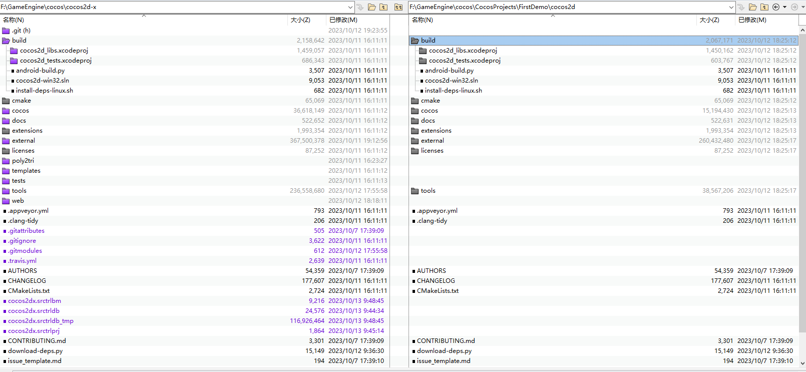

### demo工程分析

#### 工程目录结构
    .
    ├── ...
    ├── FirstDemo                        # 工程根目录
    │   ├── Classes                          # c++代码目录，初始放了一个helloword场景类，一个委托类
    |   |   ├── AppDelegate.cpp                  # 应用委托，一些系统回调（启动，进入后台/前台），做了启动后的游戏初始化工作
    |   |   ├── AppDelegate.h                    # 头文件
    |   |   ├── HelloWorldScene.cpp              # 初始化了一个默认场景 
    |   |   └── HelloWorldScene.h                # 头文件
    │   ├── cmake-build                      # cmake构建的目录，忽略
    │   ├── cocos2d                          # cocos2d引擎库，粗略来看，就是创建项目时从cocos2d-x复制过来的
    |   |   ├── build                            # 应该和构建相关
    |   |   ├── cmake                            # 可能和cmake工具相关
    |   |   ├── cocos                            # 引擎核心源码
    |   |   ├── docs                             # 说明文档
    |   |   ├── extensions                       # 扩展库
    |   |   ├── external                         # 第三方库
    |   |   ├── licenses                         # 许可
    |   |   ├── tools                            # 一些工具
    |   |   └── ...                              # 一些依赖下载脚本、cmake脚本之类的东西
    │   ├── proj.android                     # 用于构建安卓工程的
    │   ├── proj.ios_mac                     # 用于构建ios/mac工程的
    │   ├── proj.linux                       # 用于构建linux工程的
    │   ├── proj.win32                       # 用于构建windows工程的
    │   ├── Resources                        # 资源文件，字体、图片之类的
    |   |   ├── fonts                            # 字体
    |   |   ├── res                              # 资源路径
    |   |   |   └── .gitkeep                     # 新建工程会发现这个神奇文件。因为git不会推空文件夹，只是为了让git不要忽略这个文件夹。说明不可或缺~
    |   |   ├── CloseNormal.png                  # 打开图片，这就是demo的关闭按钮。从HelloWorldScene.cpp读取图片的参数来看，Resources是检索资源的根目录。
    |   |   ├── CloseNormal.png                  # demo的关闭按钮按下状态时显示的图片
    |   |   └── HelloWorld.png                   # cocos的logo，显示在demo中间
    │   ├── .cocos-project.json              # cocos 工程配置
    │   └── CMakeLists.txt                   # cmake构建脚本
    └── ...

引擎库cocos2d-x目录和工程内cocos2d目录对比：<br>
 <br>
<br>

- 从目录结构来看，主要需要关注的是`Classes`、`cocos2d`、`Resources`这几个目录
1. `Classes`放源代码，实现业务逻辑
2. `cocos2d`引擎库，游戏底层框架
3. `Resources`资源目录，存放图片模型等

<br>
- 下面proj.* 是一些和平台相关的，以proj.android为例，官方的介绍是：<br>
`Cocos2d-x supports Android Studio. Simple open the proj.android directory from within the Android Studio environment.`<br>
也就是说可以通过Android Studio 打开这个proj.android <br>

<br>

#### 游戏Demo怎么跑起来？
以win32为例<br>

##### 在proj.win32目录下面，有一个`main.cpp`文件，这里定义了程序入口<br>
```cpp
#include "main.h"
#include "AppDelegate.h"
#include "cocos2d.h"

int WINAPI _tWinMain(HINSTANCE hInstance,
                       HINSTANCE hPrevInstance,
                       LPTSTR    lpCmdLine,
                       int       nCmdShow)
{
    UNREFERENCED_PARAMETER(hPrevInstance);
    UNREFERENCED_PARAMETER(lpCmdLine);

    // create the application instance
    AppDelegate app;
    return Application::getInstance()->run();
}
```
- 这里创建了一个`AppDelegate`类实例 `app` <br>
- 调用`Application`的`run`函数启动游戏生命周期<br>
- 在`cocos2d.h`头文件中根据平台引入了`CCApplication-win32.h`  <br>
``` cpp 
#if (CC_TARGET_PLATFORM == CC_PLATFORM_WIN32)
    #include "platform/win32/CCApplication-win32.h"
    #include "platform/desktop/CCGLViewImpl-desktop.h"
    #include "platform/win32/CCGL-win32.h"
    #include "platform/win32/CCStdC-win32.h"
#endif // CC_TARGET_PLATFORM == CC_PLATFORM_WIN32
```
- 在`CCApplication-win32.cpp`可以找到`run`函数的定义，整个游戏的`tick`就在`run`函数的`while`循环里面 <br>
```cpp
......
auto director = Director::getInstance();
auto glview = director->getOpenGLView();
......
while(!glview->windowShouldClose())
    {
        QueryPerformanceCounter(&nNow);
        interval = nNow.QuadPart - nLast.QuadPart;
        if (interval >= _animationInterval.QuadPart)
        {
            nLast.QuadPart = nNow.QuadPart;
            director->mainLoop();
            glview->pollEvents();
        }
        else
        {
            // The precision of timer on Windows is set to highest (1ms) by 'timeBeginPeriod' from above code,
            // but it's still not precise enough. For example, if the precision of timer is 1ms,
            // Sleep(3) may make a sleep of 2ms or 4ms. Therefore, we subtract 1ms here to make Sleep time shorter.
            // If 'waitMS' is equal or less than 1ms, don't sleep and run into next loop to
            // boost CPU to next frame accurately.
            waitMS = (_animationInterval.QuadPart - interval) * 1000LL / freq.QuadPart - 1L;
            if (waitMS > 1L)
                Sleep(waitMS);
        }
    }
```
- `while`循环就这样无情的推动着`director`和`glview`向前跑，`director`负责逻辑，`glview`负责渲染。
<br>

#####  看看`Director`主循环做了什么
```cpp
void Director::mainLoop()
{
    if (_purgeDirectorInNextLoop)
    {
        _purgeDirectorInNextLoop = false;
        purgeDirector();
    }
    else if (_restartDirectorInNextLoop)
    {
        _restartDirectorInNextLoop = false;
        restartDirector();
    }
    else if (! _invalid)
    {
        drawScene();
     
        // release the objects
        PoolManager::getInstance()->getCurrentPool()->clear();
    }
}
```
- 前两个分支从命名看，应该是清理/重启导演
- 最后一个分支绘制场景
<br>

##### 进入场景绘制`drawScene`函数
``` cpp 
// Draw the Scene
void Director::drawScene()
{
    // 计算deltaTime，两次DrawScene的时间间隔
    calculateDeltaTime();
    
    if (_openGLView)
    {
        _openGLView->pollEvents();
    }

    //tick before glClear: issue #533
    if (! _paused)
    {
        // 事件派发，update之前
        _eventDispatcher->dispatchEvent(_eventBeforeUpdate);
        // 主循环，驱动各个模块的update函数 
        _scheduler->update(_deltaTime);
        // 事件派发，update之后
        _eventDispatcher->dispatchEvent(_eventAfterUpdate);
    }

    // 执行openGL绘制清理：
    // glClearColor（）
    // glClear ()
    _renderer->clear();
    // 清理帧缓冲对象(FBOs)
    experimental::FrameBuffer::clearAllFBOs();
    
    // 事件派发，绘制之前
    _eventDispatcher->dispatchEvent(_eventBeforeDraw);
    
    /* to avoid flickr, nextScene MUST be here: after tick and before draw.
     * FIXME: Which bug is this one. It seems that it can't be reproduced with v0.9
     */
    if (_nextScene)
    {
        //场景切换
        setNextScene();
    }

    // mv 矩阵压入堆栈
    pushMatrix(MATRIX_STACK_TYPE::MATRIX_STACK_MODELVIEW);
    
    if (_runningScene)
    {
#if (CC_USE_PHYSICS || (CC_USE_3D_PHYSICS && CC_ENABLE_BULLET_INTEGRATION) || CC_USE_NAVMESH)
        // 推进2d物理、3d物理、navmesh
        _runningScene->stepPhysicsAndNavigation(_deltaTime);
#endif
        //clear draw stats
        //清空绘制统计，顶点数、绘制批次清零
        _renderer->clearDrawStats();
        
        //render the scene
        /*GLView 指针，负责所有渲染
        The _openGLView, where everything is rendered, GLView is a abstract class,cocos2d-x provide GLViewImpl
        which inherit from it as default renderer context,you can have your own by inherit from it*/
        if(_openGLView)
            // 场景绘制
            _openGLView->renderScene(_runningScene, _renderer);
        
        _eventDispatcher->dispatchEvent(_eventAfterVisit);
    }

    // draw the notifications node
    if (_notificationNode)
    {
        _notificationNode->visit(_renderer, Mat4::IDENTITY, 0);
    }

    // 帧率更新
    updateFrameRate();
    
    if (_displayStats)
    {
#if !CC_STRIP_FPS
        //显示统计信息
        showStats();
#endif
    }
    
    // 再渲染一次？
    _renderer->render();
    // 事件派发，绘制之后
    _eventDispatcher->dispatchEvent(_eventAfterDraw);
    // mv 矩阵弹出堆栈
    popMatrix(MATRIX_STACK_TYPE::MATRIX_STACK_MODELVIEW);
    // 总帧数增加
    _totalFrames++;

    // swap buffers
    if (_openGLView)
    {
        _openGLView->swapBuffers();
    }

    if (_displayStats)
    {
#if !CC_STRIP_FPS
        calculateMPF();
#endif
    }
}
```

在`while`循环的推动下，游戏巨轮滚滚向前